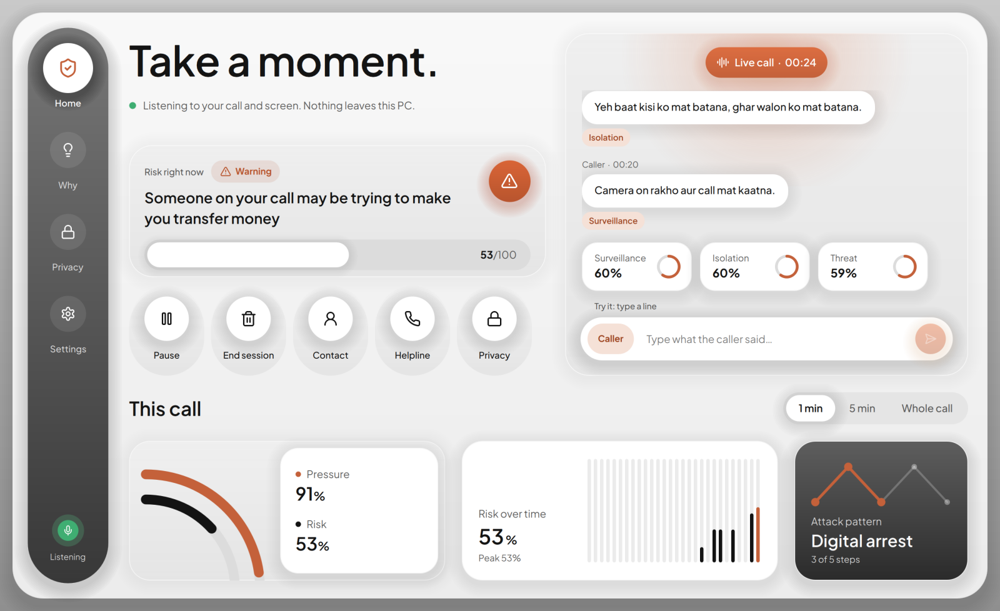
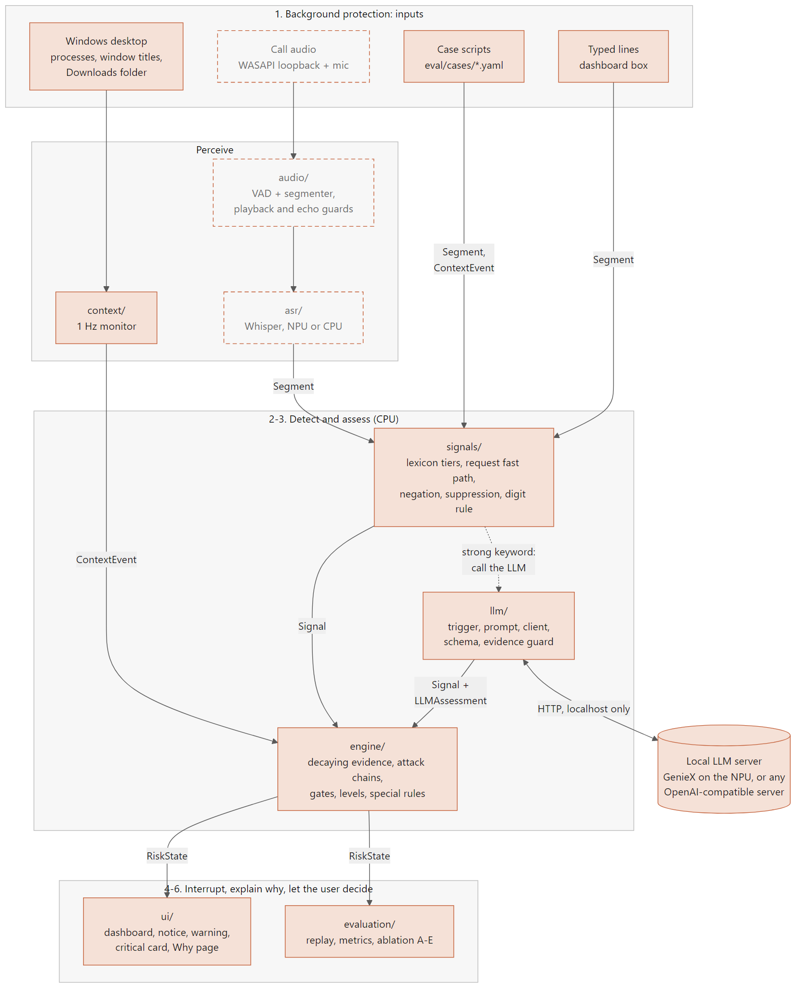

# Chaukas (चौकस)

**An on-device AI guardian against social engineering on Windows PCs.**

> Chaukas doesn't ask whether a word, website or app is dangerous. It asks whether someone
> is manipulating you into using it dangerously.

Chaukas (Hindi for "alert, watchful") listens to a call on your PC and watches what happens
on screen. When a caller claiming to be the police, the CBI, your bank or tech support
starts pressuring you towards sending money, installing remote-access software or reading
out an OTP, Chaukas interrupts, explains why, and lets you decide. Everything runs on the
PC. Free and open source (Apache-2.0), built for the Snapdragon® AI Lab Build & Present
Challenge.



> **Status (September 2026): work in progress.** The detection engine, LLM reasoning layer,
> desktop monitor and the window are built and tested. **Live call audio and
> speech-to-text are not built yet**, so today Chaukas runs on scripted demo calls and on
> lines you type in. No evaluation or Snapdragon benchmark results exist yet. See
> [What works today](#what-works-today).

## Contents

- [Run it in 5 minutes](#run-it-in-5-minutes)
- [The problem](#the-problem)
- [The idea: suspicious combinations](#the-idea-suspicious-combinations)
- [How it works](#how-it-works)
- [What you see](#what-you-see)
- [What works today](#what-works-today)
- [Privacy](#privacy)
- [Commands](#commands)
- [Development](#development)
- [Related work](#related-work)
- [Limitations](#limitations)
- [Roadmap](#roadmap)
- [Credits and licences](#credits-and-licences)

## Run it in 5 minutes

No microphone, headphones or meeting app needed. You need Windows 10 or 11 and
[uv](https://docs.astral.sh/uv/getting-started/installation/) (it installs the right
Python for you).

```powershell
git clone https://github.com/devansh7439/Chaukas.git
cd Chaukas
uv sync --extra ui --extra context
uv run chaukas ui --demo eval/cases/DA01.yaml
```

The window plays a simulated "digital arrest" call in real time:

| Time | What happens |
|---|---|
| 0-8 s | The caller claims to be from the CBI and mentions a money-laundering case |
| ~8 s | **Notice**: someone may be pressuring you |
| ~20 s | **Warning** after "kisi ko mat batana" (don't tell anyone): a side panel with the evidence |
| ~29 s | **Critical** when a (mock) bank transfer page opens: a full-screen pause card |

On the critical card, tick **I understand this warning** to unlock **Continue anyway**.
Nothing is ever blocked.

Other ways to try it:

```powershell
uv run chaukas ui --demo eval/cases/CT01.yaml --speed 2   # an OTP scam, twice as fast
uv run chaukas ui                                          # empty session: type lines yourself
```

In the empty session, type into **Type what the caller said...**, for example
`SBI bank se bol raha hoon, OTP batao`, and the critical card appears before any code is
spoken. Continue past it, switch the speaker pill to **You** and type `4 5 6 7`: the
recovery card appears. Settings has English and हिन्दी.

## The problem

Social engineering doesn't hack the computer; it hacks the decision. A caller poses as an
official, frightens the victim ("your Aadhaar is linked to a money-laundering case"),
isolates them ("don't tell your family, stay on camera"), and steers them into doing the
harmful thing themselves: transferring money, installing AnyDesk, or reading out an OTP.
Antivirus sees nothing wrong, because every action is one the user chose to take.

## The idea: suspicious combinations

Chaukas doesn't flag suspicious words or suspicious actions. It flags **suspicious
combinations**.

| What Chaukas sees | Could be | Verdict |
|---|---|---|
| "CBI" + "arrest" | A news report | Not enough |
| Installing AnyDesk | Real IT support you asked for | Not enough |
| "CBI officer" + "don't tell anyone" + "install AnyDesk" | Social engineering | **Warn** |

It tracks three attack patterns, each a sequence of steps:

| Attack | Typical chain | What the attacker wants | How PC-native |
|---|---|---|---|
| Digital arrest | Fake authority → threat → isolation / surveillance → money request → bank page | Money | Partly: many victims pay from a phone |
| Remote access | Fake support → fear ("hacked", "virus") → install remote tool → tool starts | Control of the computer | Fully |
| Credential theft | Fake bank / authority → urgency → OTP / PIN / password request | Account access | Partly: the OTP often arrives on a phone |

## How it works



1. **Detect.** Each line of the call is normalised and scanned for tactics (authority,
   threat, urgency, isolation, surveillance, money / remote-access / credential requests) in
   English, romanised Hindi and Devanagari. Protective advice ("we will never ask for your
   OTP") and Chaukas's own alert sentences don't count.
2. **Reason.** A local LLM is asked, sparingly, "what is the caller trying to make the
   user do?". Every claim it makes must quote the line it came from, or it is thrown away.
   It also says whether the speech is aimed at you (a news report is not).
3. **Watch the screen.** Remote-access tools starting, banking and transfer pages (by window
   title), and executables arriving in Downloads.
4. **Assess.** Evidence (which fades over minutes of speech, not silence) combines into a
   risk score, held back unless the screen and the attack pattern agree:
   `R = pressure × addressed-to-you × matching-action × attack-sequence`.
   Critical needs a coercive tactic, every required step of the attack, and matching screen
   activity; a caller asking for an OTP after claiming authority is critical immediately,
   before you answer.
5. **Interrupt, explain, let you decide.** Alerts escalate, every reason is shown with the
   moment it happened, and you choose what to do.

Details: **[docs/ARCHITECTURE.md](docs/ARCHITECTURE.md)** (components, runtime flow, risk
engine, threads, design decisions) and **[docs/DATA_MODEL.md](docs/DATA_MODEL.md)**
(entity-relationship diagram, every data type and file schema). The full design spec is
[Chaukas_BLUEPRINT.md](Chaukas_BLUEPRINT.md).

## What you see

| Level | When | What Chaukas shows |
|---|---|---|
| Protected | Nothing suspicious | Dashboard: "You're protected." and a listening indicator |
| Notice | Some pressure | A small card in the corner |
| Warning | Pressure plus coercion (threat, isolation, surveillance) | A side panel: what the caller seems to want, the evidence, safe next steps |
| Critical | The whole attack pattern, matched on screen | A full-screen pause card; "Continue anyway" unlocks after "I understand" |
| Act now | You read out a code after an OTP warning | Recovery card: call your bank on the number printed on your card |

The warning panel, the critical card and the Why page offer **Verify independently** (hang
up, call a number you found yourself), your **trusted contact** (shown large; Chaukas never
places calls) and the **cybercrime helpline 1930**. The Why page lists every reason with
its time and the words used.

## What works today

| Part | Status |
|---|---|
| Keyword and request detection (English, romanised Hindi, Devanagari) | Built, tested |
| Risk engine: attack chains, gates, levels, OTP rules, the blueprint's 16 worked examples | Built, tested |
| LLM reasoning layer (any OpenAI-compatible local server) | Built, tested against a stand-in server; not yet run against a real model |
| Desktop monitor: remote tools, bank / transfer / OTP pages, downloads | Built, tested (including real Windows calls) |
| The window: dashboard, alerts, Why / Privacy / Settings, English and Hindi | Built, tested; runs on demo scripts and typed lines |
| Replay, metrics with confidence intervals, ablations A-E | Built, tested |
| Live audio capture, voice activity detection, echo and playback guards | **Not built** |
| Speech-to-text (Whisper on the Snapdragon NPU, CPU fallback) | **Not built** |
| Wiring the LLM and the desktop monitor into the window | **Not built** (both work in replay and tests) |
| Tray icon, spoken alerts, onboarding, triggered OCR | **Not built** |
| 60-case evaluation dataset, results, NPU vs CPU benchmarks | **Not done** (4 build-time demo cases exist) |

Quality: 556 automated tests, 97% line coverage, `ruff` and `mypy --strict` clean.
Progress, decisions and what is left: [docs/WORKLOG.md](docs/WORKLOG.md).

## Privacy

- **Nothing about the call is saved.** Audio, transcripts, evidence and risk states live in
  memory for the current session only and are discarded when it ends ("End session", or
  soon, 30 minutes of silence). Chaukas has no database. See
  [docs/DATA_MODEL.md](docs/DATA_MODEL.md#storage).
- **Nothing is uploaded.** Speech-to-text and the LLM are designed to run on the PC; the
  LLM is reached over `localhost` only.
- **The only file written during normal use** is `%APPDATA%\Chaukas\settings.json`:
  language, trusted contact, and one switch.
- **You can see and control it.** A listening indicator is always visible, with Pause and
  End session one click away.
- **Optional:** hide Chaukas's alerts from screen sharing, so a remote "support agent"
  can't see the warning. This also hides them from screen recorders on the same PC, so it is
  off by default.
- Not yet verified: the blueprint's firewall test that proves Chaukas works fully offline.
  Until it has been run, we don't claim "makes no network calls".

## Commands

```powershell
uv run chaukas ui [--demo CASE] [--speed N]            # the window
uv run chaukas ui --demo CASE --screenshot out.png --at 35   # render PNGs headless and exit
uv run chaukas replay eval/cases/DA01.yaml --ablation D      # one case's alert timeline
uv run chaukas eval eval/cases --ablation D                  # score every case
uv run chaukas ablate eval/cases                             # configurations A-E side by side
uv run chaukas check-config                                  # print the merged configuration
```

Every command accepts `--config FILE.yaml` (repeatable) to override
[default.yaml](src/chaukas/resources/default.yaml). Ablation configurations: **A** keywords
only, **B** + LLM, **C** + action gate, **D** full Chaukas, **E** full without the LLM
(the default, since the LLM is optional).

**Using a real LLM** with `replay`, `eval` or `ablate`: start any OpenAI-compatible server
(GenieX on Snapdragon, or llama.cpp / Ollama / LM Studio on a dev PC), point Chaukas at it,
and add `--llm`:

```yaml
# my-llm.yaml
llm:
  base_url: http://127.0.0.1:8080/v1
  model: your-model-name
```

```powershell
uv run chaukas eval eval/cases --ablation D --llm --config my-llm.yaml --llm-cache eval/cache/mymodel
uv run chaukas eval eval/cases --ablation D --llm --config my-llm.yaml --llm-cache eval/cache/mymodel --llm-offline
```

The first run records every answer with its measured latency; `--llm-offline` replays them
exactly, with no model running. Without `--llm`, only verdicts scripted in development
cases are used, and the output says so.

## Development

```powershell
uv sync --extra ui --extra context   # everything the code uses today
uv run pytest                        # tests (headless: the window renders offscreen)
uv run ruff check .                  # lint
uv run ruff format --check .         # formatting
uv run mypy                          # strict type check
```

Python 3.12 (pinned in `.python-version`; 3.11 also supported). If `uv run pytest` fails
with "uv trampoline failed to canonicalize script path", the virtual environment's launchers
are stale: run `uv sync --reinstall`.

```
src/chaukas/
  core/          data types, event bus, clocks, time windows, config
  signals/       normaliser, Aho-Corasick lexicon, request fast path, digit rule
  engine/        evidence decay, attack chains, gates, levels, special rules
  llm/           trigger policy, prompt, client, reply schema, evidence guard, cache
  context/       process / window / download watchers, Windows API readers
  evaluation/    case scripts, session pipeline, replay, metrics, ablations
  ui/            window: live session, presenter, Qt bridge, QML views, fonts, icons
  resources/     default.yaml, lexicon.yaml, templates.yaml, context.yaml
eval/cases/      case scripts (YAML)
docs/            ARCHITECTURE.md, DATA_MODEL.md, WORKLOG.md, diagrams, images
tests/           one folder per package
```

Every change is written test-first; the tests cover the blueprint's worked examples,
real local HTTP servers, real Windows API calls, and the QML loading with zero Qt warnings.

## Related work

| Product | What it does | How Chaukas differs |
|---|---|---|
| Google Scam Detection (Pixel; Samsung's Phone app) | On-device scam-pattern detection in phone calls | Phones only. Chaukas runs on the PC, understands Hindi / Hinglish, and links what is said to what happens on screen |
| Android screen-sharing warning (India) | Warns when an unknown caller shares the screen and a payment app opens | Action only, phone only. Chaukas combines the action with the conversation |
| Microsoft Edge scareware blocker | Detects full-screen tech-support scam web pages | Detects pages, not conversations. A scam that is all talk plus AnyDesk never shows a scam page |

Chaukas complements these: it is the PC-side, Indian-language, action-aware layer.

## Limitations

- **Calls taken on a phone are not covered**, and not every calling app has been tested.
  Chaukas listens to the PC's system audio and microphone.
- **Money sent from a phone** instead of the PC reaches warning at most, because the
  transfer never appears on screen.
- **Without headphones** the microphone also hears the caller; the planned echo guard
  reduces this but headphones are recommended.
- **Friction, not a wall.** Someone with remote control of the PC can close Chaukas, and a
  frightened person can click through warnings. It is a speed bump, not a guarantee.
- **Known false alarm:** legitimate IT support that mentions a virus can reach warning
  (never critical).
- Languages: English, Hindi and Hinglish only. The Hindi text still needs a native
  speaker's review.
- Every threshold is a starting value to be tuned on a development split and frozen before
  testing; no detection or false-alarm rate is claimed yet.

## Roadmap

1. Live audio: two-stream capture, voice activity detection, playback and echo guards.
2. Speech-to-text: Whisper on the Snapdragon NPU (ONNX Runtime + QNN), CPU fallback.
3. Live pipeline: LLM and desktop monitor wired into the window; privacy horizon and
   30-minute session end; tray icon, spoken alerts, onboarding; `run.bat`.
4. Evaluation: 60 recorded cases (30 attack, 30 benign; blind scripts in the test split),
   the A-E ablation, NPU vs CPU benchmarks on real Snapdragon hardware.

## Credits and licences

- Chaukas: [Apache License 2.0](LICENSE).
- Libraries: [PySide6](https://doc.qt.io/qtforpython/) (LGPL-3.0), pydantic (MIT),
  PyYAML (MIT), psutil (BSD-3-Clause), watchdog (Apache-2.0), mss (MIT).
- Bundled assets: [Plus Jakarta Sans](https://github.com/tokotype/PlusJakartaSans) and
  [Noto Sans Devanagari](https://github.com/notofonts/devanagari) (SIL Open Font License
  1.1; licence files in `src/chaukas/ui/assets/fonts/`), [Lucide](https://lucide.dev)
  icons (ISC; licence in `src/chaukas/ui/assets/icons/`).
- Planned: Whisper (MIT), Silero VAD (MIT), GenieX (BSD-3-Clause). Model files will never
  be committed; a download script will fetch them from their official sources.
- "DemoBank (MOCK)" is fictional. Demo calls are scripted; no real victim audio and no real
  bank names are used.
