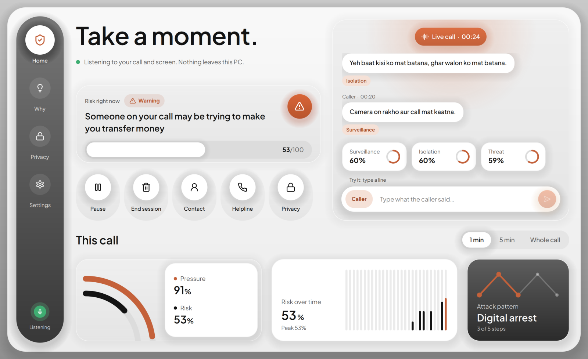

# Chaukas (चौकस)

**An on-device AI guardian against social engineering on Windows PCs.**

> Chaukas doesn't ask whether a word, website or app is dangerous. It asks whether someone
> is manipulating you into using it dangerously.

Chaukas (Hindi for "alert, watchful") listens to a call on your PC and watches what happens
on screen. When a caller claiming to be the police, the CBI, your bank or tech support
starts pressuring you towards sending money, installing remote-access software or reading
out an OTP, Chaukas interrupts, explains why, and lets you decide. Speech recognition and
everything else run on the PC. Free and open source (Apache-2.0), built for the
Snapdragon® AI Lab Build & Present Challenge.



> **At a glance (30 September 2026).** Live protection works end to end on a Windows PC: it
> hears a call (what the PC plays, and your microphone), transcribes it on the device with
> Whisper, watches the screen, and raises the alert.
>
> - **Detection:** across five fresh test sets (each committed before its only run;
>   synthetic and not blind) it caught **31 of 36 scams** and correctly stayed quiet on **28
>   of 33** deliberately hard innocent look-alikes (the false alarms: a film, a news report,
>   and three callers asking for a code or password: a delivery agent, a family member, an
>   IT helpdesk; the film-and-news kind is what call presence now fixes, 7/7 → 0/7 on a
>   fresh set). See [Results](#results).
> - **Snapdragon:** Whisper's encoder runs on the Hexagon NPU with a safe CPU fallback:
>   **151 ms** per 30 s window on an X Elite, **70 ms** on an X2 Elite (real devices via
>   Qualcomm AI Hub), 8× faster than this project's Intel laptop CPU; and with the encoder
>   run on a real X Elite NPU, all 24 spoken test calls got **the same alert as on the CPU**.
>   See [Snapdragon](#snapdragon).
> - **Try it in 5 minutes**, no microphone needed: [Run it](#run-it).
>   Pitch deck: [docs/Chaukas-Pitch.pdf](docs/Chaukas-Pitch.pdf).

## Contents

- [Run it](#run-it)
- [The problem](#the-problem)
- [The idea: suspicious combinations](#the-idea-suspicious-combinations)
- [How it works](#how-it-works)
- [What you see](#what-you-see)
- [Results](#results)
- [Snapdragon](#snapdragon)
- [What works today](#what-works-today)
- [Privacy](#privacy)
- [Security](#security)
- [Commands](#commands)
- [Development](#development)
- [Related work](#related-work)
- [Limitations](#limitations)
- [How this was built](#how-this-was-built)
- [Credits and licences](#credits-and-licences)

## Run it

You need Windows 10 or 11 and [uv](https://docs.astral.sh/uv/getting-started/installation/)
(it installs the right Python for you).

**A demo in 5 minutes** (no microphone, no call, no model downloads):

```powershell
git clone https://github.com/devansh7439/Chaukas.git
cd Chaukas
uv sync --extra ui --extra context
uv run chaukas ui --demo eval/cases/DA01.yaml
```

The window plays a simulated "digital arrest" call in real time:

| Time | What happens |
|---|---|
| 0-8 s | The caller claims to be from the CBI and mentions a money-laundering case |
| ~8 s | **Notice**: someone may be pressuring you |
| ~20 s | **Warning** after "kisi ko mat batana" (don't tell anyone): a side panel with the evidence |
| ~29 s | **Critical** when a (mock) bank transfer page opens: a full-screen pause card |

On the critical card, tick **I understand this warning** to unlock **Continue anyway**.
Nothing is ever blocked. `uv run chaukas ui` opens an empty session where you type lines
yourself: try `SBI bank se bol raha hoon, OTP batao`, then switch the speaker to **You**
and type `4 5 6 7`.

**Live protection on your own calls, without a terminal:** download the repository (Code ›
Download ZIP, then extract it) and double-click **`install.bat`**. It offers to install uv
if it is missing, installs Chaukas, downloads its models (the only time Chaukas uses the
network) and puts a **Chaukas** icon on your Desktop; double-click that icon to start
protection. From a terminal, the same steps are:

```powershell
run.bat setup    # once: installs everything, downloads Whisper small (~250 MB) and the
                 # voice-detection model (1.2 MB), SHA-256 checked, and lists your devices
run.bat          # start protecting; leave it running during calls
```

Chaukas listens to what the PC plays (the other person in WhatsApp, Zoom, Teams, Meet,
etc.) and to your default microphone. Headphones give the cleanest result. `run.bat`
passes options through, e.g. `run.bat --language hi`.

## The problem

Social engineering doesn't hack the computer; it hacks the decision. A caller poses as an
official, frightens the victim ("your Aadhaar is linked to a money-laundering case"),
isolates them ("don't tell your family, stay on camera"), and steers them into doing the
harmful thing themselves: transferring money, installing AnyDesk, or reading out an OTP.
Antivirus sees nothing wrong, because every action is one the user chose to take.

## The idea: suspicious combinations

Chaukas doesn't flag suspicious words or suspicious actions. It flags **suspicious
combinations**.

| What Chaukas sees | Could be | Verdict |
|---|---|---|
| "CBI" + "arrest" | A news report | Not enough |
| Installing AnyDesk | Real IT support you asked for | Not enough |
| "CBI officer" + "don't tell anyone" + "install AnyDesk" | Social engineering | **Warn** |

It tracks three attack patterns, each a sequence of steps:

| Attack | Typical chain | What the attacker wants |
|---|---|---|
| Digital arrest | Fake authority → threat → isolation / surveillance → money request → bank page | Money |
| Remote access | Fake support → fear or a "refund" → install a remote tool → tool starts → bank opens | Control of the computer |
| Credential theft | Fake bank / authority → urgency → OTP / code request → the user reads it out | Account access |

## How it works


1. **Hear.** Two audio streams through WASAPI: what the PC plays (the caller) and the
   microphone (you). Silero voice detection cuts speech into sentences; the microphone's
   copy of the caller's voice (laptop speakers) is skipped before transcription.
2. **Transcribe.** Whisper small (int8) on ONNX Runtime, on the device. Each speaker's
   language is detected once and reused; a backlog is transcribed in one call.
3. **Detect.** Each line is normalised and scanned for tactics (authority, threat,
   urgency, isolation, surveillance, money / remote-access / credential requests) in
   English, romanised Hindi and Devanagari. Spoken numbers ("char saat do nau") count as
   digits. Protective advice ("we will never ask for your OTP") doesn't count.
4. **Watch the screen.** Remote-access tools starting, banking and transfer pages (by
   window title), and executables arriving in Downloads. While a call is already
   suspicious (notice or higher), the active window's text is read with Windows' built-in
   OCR every few seconds, so an "Enter OTP" box under a generic title is seen too; the
   image and text are never stored.
5. **Assess.** Evidence (which fades over minutes of speech, not silence) combines into a
   risk score, held back unless the screen and the attack pattern agree:
   `R = pressure × addressed-to-you × matching-action × attack-sequence`.
   Critical needs a coercive tactic, every required step of the attack, and matching screen
   activity; a caller asking for an OTP after claiming authority is critical immediately,
   before you answer.
6. **Interrupt, explain, let you decide.** Alerts escalate, every reason is shown with the
   moment it happened, and you choose what to do.

**Paraphrases: a semantic intent layer.** Next to the keywords, each caller line is
compared by meaning with example sentences per intent ("read me the digits we sent",
"let me get onto your computer", "move your savings to the account I give you"), using a
small multilingual embedding model on the device (MiniLM, int8, ~120 MB, 9 ms per line).
It detects *intent*, never "scam": a match is ordinary evidence with a capped confidence,
look-alikes such as protective advice are listed as counter-examples, and the risk engine
still decides. It covers English and Hindi in Devanagari; Roman-script Hinglish stays with
the lexicon, because the model confuses any two Hinglish sentences (measured).

An optional **local LLM** (Qwen2.5-1.5B via llama.cpp) can be asked "what is the caller
trying to make the user do?"; every claim must quote the caller's actual words. It is
**off by default**, because on our tests it added false alarms (see [Results](#results)).

Details: **[docs/ARCHITECTURE.md](docs/ARCHITECTURE.md)** (components, runtime flow, risk
engine, threads, design decisions) and **[docs/DATA_MODEL.md](docs/DATA_MODEL.md)**
(entity-relationship diagram, every data type and file schema). The design spec is
[Chaukas_BLUEPRINT.md](Chaukas_BLUEPRINT.md); every step, measurement and decision is in
[docs/WORKLOG.md](docs/WORKLOG.md).

## What you see

| Level | When | What Chaukas shows |
|---|---|---|
| Protected | Nothing suspicious | Dashboard: "You're protected." and a listening indicator |
| Notice | Some pressure | A small card in the corner |
| Warning | Pressure plus coercion (threat, isolation, surveillance), or a remote-control session followed by banking after an organisation claim | A side panel: what the caller seems to want, the evidence, safe next steps |
| Critical | The whole attack pattern, matched on screen | A full-screen pause card; "Continue anyway" unlocks after "I understand" |
| Act now | You read out a code after an OTP warning | Recovery card: call your bank on the number printed on your card |

The warning panel, the critical card and the Why page offer **Verify independently** (hang
up, call a number you found yourself), your **trusted contact** (shown large; Chaukas never
places calls) and the **cybercrime helpline 1930**.

## Results

All numbers below were measured on one Intel Core i7-1360P laptop (CPU only). All call
scripts are synthetic (written for this project, no real victims), and none of them is
blind: the same assistant wrote the detector and the cases.

**Latest, after the red-team review (28 September; configuration E, the default:
keywords + semantic layer + engine + screen, no LLM):**

| Set | Status of the set | Scams detected | Critical before harm | False alarms |
|---|---|---|---|---|
| Red-team set D (12 attacks, 8 hard look-alikes) | Fresh: committed before its only run | **11/12** | 9/12 | **3/8** |
| Set E: remote control (8 attacks, 8 look-alikes) | Fresh: committed before its only run | **6/8** (1/8 before the organisation-claim rule) | 1/8 | **0/8** |
| Set G: call presence (6 scam calls, 7 films / news / videos playing with **no call**) | Fresh: committed before its only run | **6/6** | 4/6 | **0/7** (7/7 before the call-presence gate) |
| Set H: screen shared from a **browser meeting** (6 scams, 6 look-alikes: work, family, teacher, IT, accountant, friend) | Fresh: committed before any run | **5/6** (2/6 before screen-share detection) | 2/6 (0/6 before) | **0/6** (0/6 before) |
| Set I: an **OTP page during a remote session** (4 scams, 4 look-alikes) | Fresh: committed before its only run | **3/4** (1/4 before the rule) | 0/4 | 2/4 (2/4 before: a family member and an IT helpdesk asking for a code or password) |
| Set H re-run after the set I rule | Seen | 6/6 | 2/6 | 0/6 |
| Sets D + E, English cases **spoken aloud**, then heard by Whisper (13 + 11) | Seen as text; first run as audio | 11/13 (same as text) | 7/13 (same) | 2/11 (same) |
| Held-out AT/BT (8 + 8) | Seen twice before | 7/8 | 5/8 | 1/8 |
| Robustness matrix (18 + 8) | Seen before | 14/18 | 10/18 | 1/8 |
| Paraphrase sets B and C (12 + 8) | Seen before | 6/12 | 2/12 | 1/8 |
| Dev (15 + 11) | Used for development | 13/15 | 10/15 | 1/11 |

Only sets D and E are clean measurements (set E: the same fresh set, run once on the code
before and once after the rule it tests). Set D re-run on the final code catches 12/12: the
organisation-claim rule came from analysing its one miss, so that re-run is not clean.

**Through real audio** (`tools/audio_eval.py`): every line of the 24 English cases in sets D
and E was spoken by a Windows voice (Indian English: the caller as Ravi, the user as Heera),
transcribed by Chaukas's Whisper and scored on what Whisper heard. Every outcome matched
the text run, although Whisper misheard words ("refunds team" as "Reefens team",
"courier company" as "Korea Company") and turned spoken digits into numbers. It also heard
"AnyDesk" as "any disk", which is now recognised. Still synthetic speech: no real voices,
noise or Hinglish. The tables below keep the history in the order it
happened, including each set's first, clean run.

**History.** Detection (configuration E):

| | Held-out test, 16 cases, first run | Held-out, second run (after fixes) | Dev, 16 cases |
|---|---|---|---|
| Scams detected (warning or higher) | 3/8 | **7/8** | 9/9 |
| Critical before the harm happened | 0/8 | **5/8** | 8/9 |
| False alarms on innocent calls | 0/8 | **0/8** | 0/7 |

How to read this, honestly:
- The 16 held-out cases (8 scams, 8 look-alike innocent calls such as a delivery agent
  asking for the order OTP, a real bank fraud alert, family asking for rent money, a work
  screen share, film dialogue) were committed before their first run. The first run
  exposed three general gaps; the fixes were developed on **separate** dev cases only,
  then the held-out set was run once more. It has now been seen twice, so the second
  number is optimistic; a fresh set is needed for a clean claim.
- The samples are small: 7/8 has a 95 % confidence interval of 53-98 %.
- Remaining misses: a refund scam where "Amazon customer support" isn't recognised as an
  organisation claim (notice only), and two scams that reach warning but not critical.
- These are transcripts replayed through the engine. Live audio adds speech-recognition
  errors, measured only on synthetic English speech so far (below).

**Robustness matrix** (26 new cases, committed before their only run, tag
`eval-robust-1`; configuration E): three scam intents, each in six variants, plus eight
legitimate look-alikes.

| Variant | OTP theft | Digital arrest | Remote access | Detected |
|---|---|---|---|---|
| Hinglish, usual wording | missed | ✓ critical | ✓ critical | 2/3 |
| English paraphrase (no "OTP", "arrest", tool names) | missed | missed | missed | **0/3** |
| Hindi in Devanagari | ✓ critical | ✓ critical | ✓ critical | 3/3 |
| Indirect request ("confirm the number", "refundable amount", a "refund") | missed | ✓ warning | missed | 1/3 |
| Reordered (request before authority) | ✓ critical | ✓ warning | missed | 2/3 |
| Adversarial ("bank never asks, but tell *me*", "the warning app is fake") | missed | ✓ critical | ✓ warning | 2/3 |
| **Total** | 2/6 | 5/6 | 3/6 | **10/18** |

Innocent look-alikes: 6/8 stayed at notice or below; **2 false alarms (warnings)**: a bank
agent saying "I will *send* an OTP, type it in the app" ("send" is also a request verb), and
an English-speaking delivery agent asking for the order OTP (any OTP request from someone
who hasn't claimed authority is a warning by design). This set was written after the
detector, by the same assistant that built it, so it is not blind; it is reported as-is
and will not be used for tuning. The clearest lesson: **paraphrase defeats the keyword
layer** (0/3), which led to the semantic intent layer below.

**Semantic intent layer** (built and tuned on dev cases only, frozen at tag
`semantic-frozen`; then two fresh sets written and committed before their only run, tag
`eval-paraphrase-1`; configuration E, the layer switched off and on):

| | Keywords only | + semantic layer |
|---|---|---|
| Set B: 12 fresh paraphrased scams, detected | 1/12 | **6/12** |
| Set B: critical before harm | 1/12 | 2/12 |
| Set C: 8 fresh legitimate look-alikes, false alarms | 0/8 | **1/8** |
| Robustness matrix above (second run; seen before), detected | 10/18 | 13/18 |
| Robustness matrix, false alarms | 2/8 | 2/8 |

The layer turns paraphrase from invisible into mostly caught, for one extra false alarm
(a Hindi news bulletin saying fraudsters ask for OTPs). Half of the fresh scams still get
through, mainly remote-access paraphrases ("take over your PC", "let me operate your
laptop"), which reach notice at best. Same caveat as before: synthetic cases, written by
the same assistant that built the detector, small samples.

**Red-team review** (28 September; full report in [docs/REDTEAM.md](docs/REDTEAM.md)). We
tried to break Chaukas and found eight defects, all now fixed with regression tests. Three
of them let a caller hide an OTP request with ordinary speech ("Don't worry, send the
OTP", "OTP batao *nahi toh* account band", where "nahi toh" means "otherwise"). A fourth
made ordinary Hinglish bank advice ("OTP share *mat karna*") an alarm, and a fifth let a
"CBI" heard in a video an hour earlier make an unrelated OTP request critical. Then a
fresh red-team set was written, committed before its only run (tag `eval-redteam-1`), and
run once (not blind):

| Red-team set D: 12 attacks, 8 hard look-alikes | Keywords only | + semantic layer |
|---|---|---|
| Attacks detected | 8/12 | **11/12** |
| Critical before harm | 4/12 | 9/12 |
| False alarms | 2/8 | **3/8** |

Caught: forged advice, "nahi toh", polite Hindi ("OTP confirm kar dijiye"), the caller
reciting Chaukas's own advice, reordered chains, "the warning app is fake", lower-case
transcripts without punctuation, a long call with the request 5 minutes after the claim.
Missed: a remote-control paraphrase with no tool name. False alarms: a film scene and a
news report playing on the laptop, and a delivery agent asking to be shown the code. Re-run
after the fixes (seen sets, so not clean): held-out 7/8 detected, **1/8 false alarms** (was
0/8: a delivery agent's "order ka OTP bata dijiye" is now recognised as a request, the same
words a scammer uses); robustness 14/18 and 1/8; dev 13/15 and 1/11 (one dev case had
passed only because of a semantic-layer bug, now fixed; the threshold was not lowered).

**Speech recognition** (Whisper small int8, greedy, 8 threads; 48 synthetic English clips
from 4 voices, 143 s):

| Backend | Key scam word heard | Key word invented | Word error rate | Time per clip, language auto-detected |
|---|---|---|---|---|
| ONNX Runtime (default; runs on ARM64) | 24/24 | 0/24 | 1.4 % | 2.1 s |
| faster-whisper (x64 only) | 24/24 | 0/24 | 1.4 % | 4.6 s |

**Live, end to end** (a synthetic English scam call, 14.6 s long, played through the
laptop and heard through the loopback): all four sentences transcribed and tagged;
notice 10 s, warning 13 s, **critical 17 s** after playback started, about 1 s after the
caller finished asking for the OTP.

**Local LLM** (Qwen2.5-1.5B-Instruct, 4-bit, llama.cpp on the CPU; 4 dev cases):
schema-constrained output made every reply valid JSON (12/12, was 7/15 without the
schema), median 7.1 s per call. But the 1.5B model mislabels innocent calls (a TV news
report about scams became "threat, money transfer"), giving **2/2 false alarms**, so the
LLM stays off by default. A larger model is the next thing to try.

## Snapdragon

Chaukas is built to run on Snapdragon-powered Windows on ARM64 PCs:

- Every Python dependency of live protection has a Windows ARM64 build or is pure Python:
  ONNX Runtime (with the QNN provider for the Snapdragon NPU), numpy, PySide6, psutil,
  tokenizers, SoundCard (WASAPI through cffi). x64-only libraries were replaced during the
  project: CTranslate2 → ONNX Runtime Whisper, soxr → a numpy resampler, PyAudioWPatch →
  SoundCard, watchdog → polling.
- The optional LLM server has an official llama.cpp Windows ARM64 build, which
  `chaukas setup --llm` downloads on ARM64 PCs.
- **Whisper's encoder on the NPU** (`asr.device: npu`, or `--asr-device npu`): the
  encoder, Whisper's fixed and heaviest cost, runs on the Snapdragon NPU in fp16 through
  Qualcomm's QNN plugin for ONNX Runtime (`onnxruntime-qnn`, installed on ARM64); the
  decoder and all security logic stay on the CPU. Chaukas registers the plugin, uses only
  a device of type NPU, and checks which provider ONNX Runtime actually bound (it
  otherwise falls back silently). If the NPU can't be used, speech recognition continues
  on the CPU and the status line says "speech on CPU (NPU unavailable)"; protection never
  stops.
- **Measure it:** `uv run chaukas benchmark --asr-device npu --json npu.json` prints and
  saves the encoder / decoder / total time, the providers really used, each part's
  precision, whether it fell back, the real-time factor, peak memory and whether the PC
  was on battery.

**Measured on a real Snapdragon X Elite** (30 September 2026, through Qualcomm AI Hub; median of 100 runs on each device;
which runs the model on real Snapdragon devices in Qualcomm's lab; the same fp32 encoder
file Chaukas uses, compiled for ONNX Runtime with the QNN provider, as Chaukas runs it):

| Whisper-small encoder, one 30 s window | Time | Where |
|---|---|---|
| **Snapdragon X Elite CRD, NPU** | **150 ms** | all 313 layers on the NPU; peak memory 272 MB |
| **Snapdragon X Plus 8-core CRD, NPU** | **144 ms** | all 313 layers on the NPU; peak memory 271 MB |
| **Snapdragon X2 Elite CRD, NPU** | **70 ms** | all 313 layers on the NPU; peak memory 50 MB |
| This project's Intel Core i7-1360P laptop, CPU (same fp32 file) | 1,053-1,217 ms | 7-8× slower (on battery; two runs) |
| The same laptop, Chaukas's CPU default (int8 encoder) | ~980 ms | measured with `chaukas benchmark` |

Voice detection (Silero VAD, which Chaukas runs on the CPU), on the X Elite's CPU: **0.13 ms**
per 36 ms window (median of 100; 21 MB), so it costs almost nothing. The paraphrase
(semantic) model, also on the CPU as Chaukas runs it: **44 ms** per 32-token sentence (52 MB).
All three of Chaukas's models are now measured on real Snapdragon hardware.

**Correct on the NPU, not only fast** (`tools/aihub_npu_transcripts.py`): every line of the
24 English cases of sets D and E was spoken by a Windows voice, its log-mel features were
sent to a real Snapdragon X Elite, and the encoder ran on the NPU (76 passes, one AI Hub
inference job). The outputs came back, were decoded by Chaukas's own decoder, and every
case was scored: **all 24 cases reached exactly the same alert level as with this PC's CPU
transcripts** (11/13 scams detected, 7/13 critical before harm, 2/11 false alarms, both
ways). 74 of 76 lines were transcribed identically; the other two differ in spelling only
("Adha" / "Aadha", "882137" / "8 8 2 1 3 7"). Encoder outputs vs the same fp32 model on
this CPU: cosine similarity at least 0.9992. Saved in `docs/benchmarks/`. Still not
measured: the whole pipeline running on a Snapdragon laptop, and power.

Reproduce with `uv run --with qai-hub python tools/aihub_profile.py --device "Snapdragon X
Elite CRD"` (add `--component vad` for voice detection); the full profile is in [docs/benchmarks/](docs/benchmarks/). What this does
*not* measure: the whole pipeline on a Snapdragon laptop (the decoder, voice detection and
the rest run on its CPU); that needs the hardware.

## What works today

| Part | Status |
|---|---|
| Live audio: two-stream WASAPI capture, voice detection, echo skip, sleep/wake handling | Built, tested, measured live |
| Speech-to-text: Whisper on ONNX Runtime (default) or faster-whisper, fully offline | Built, tested, measured |
| Keyword and request detection (English, romanised Hindi, Devanagari) | Built, tested |
| Risk engine: attack chains, gates, levels, OTP rules, remote-banking rule | Built, tested |
| Desktop monitor: remote tools, bank / transfer / OTP pages, downloads, screen sharing, call presence | Built, tested (real Windows calls; screen sharing checked live in Chrome and Edge) |
| Triggered OCR of the active window (Windows OCR), only while a call is suspicious | Built, tested on real rendered text |
| The window: dashboard, alerts, Why / Privacy / Settings, English and Hindi | Built, tested |
| Semantic intent layer for paraphrases (on-device embeddings; English and Devanagari) | Built, measured on fresh sets |
| Evaluation: 124 cases (26 dev, 16 held-out, 26 robustness, 20 paraphrase, 20 red-team, 16 remote control), replay, metrics with confidence intervals and breakdowns by language / intent / set, ablations A-E, `--no-semantic` | Built |
| Decision trace per alert (source, confidence, decay, contribution, chain step, rule); the Why panel is built from it | Built, tested |
| Optional local LLM (llama.cpp, managed by Chaukas; evidence guard; schema-constrained) | Built, measured; off by default, not wired into live mode |
| Whisper's encoder on the Snapdragon NPU (QNN plugin), safe CPU fallback, `chaukas benchmark` | Built; encoder measured on a real X Elite via AI Hub (150 ms); CPU fallback tested |
| Tray icon (the level at a glance; Open, Pause / Resume, Quit) and one-click `install.bat` with a Desktop shortcut | Built, tested |
| Spoken alerts: on each rise to a warning or higher, the alert is said out loud (Indian-English voice; Hindi when a Hindi voice is installed); Chaukas never reacts to its own voice | Built, tested |
| First-run welcome (live mode): what Chaukas listens to, what stays private, that you decide | Built, tested |

Quality: 946 automated tests (30 security tests, a six-hour soak test), `ruff`, `mypy --strict` and
`bandit` clean, no known vulnerabilities in the locked dependencies; CI runs all of it on
every push.

## Privacy

- **Nothing about the call is saved.** Audio, transcripts, evidence and risk states live in
  memory for the current session only: transcript lines older than 5 minutes are dropped,
  and the session ends after 30 minutes without speech or when you press End session.
  Chaukas has no database. See [docs/DATA_MODEL.md](docs/DATA_MODEL.md#storage).
- **Nothing is uploaded.** Speech-to-text runs on the PC and loads models from disk only.
  The optional LLM server is started by Chaukas and only ever listens on 127.0.0.1.
  By design, **only `chaukas setup` uses the network**, to download models (each checked
  by SHA-256).
- **Files written:** `%APPDATA%\Chaukas\settings.json` (language, trusted contact, one
  switch) and the downloaded models in `%LOCALAPPDATA%\Chaukas\models`.
- **You can see and control it.** A listening indicator is always visible, with Pause and
  End session one click away. Pause drops audio before any processing.
- **Optional:** hide Chaukas's alerts from screen sharing, so a remote "support agent"
  can't see the warning (off by default: it also hides them from your own recordings).
- Not yet verified: a firewall test proving Chaukas works with all network access blocked.
  Until it has been run, we don't claim "makes no network calls".

## Security

Chaukas has no database, user accounts or web API. Its attack surface is text it doesn't
control (the caller's words, web page titles, file names), data it must not leak
(transcripts, codes read out, your trusted contact), what it downloads, and the one
network service it can start (the optional LLM server). Reviewed on 28 September 2026:

| Check | Result |
|---|---|
| Static analysis (`bandit`, all of `src/`) | No medium or high findings (four `urlopen` calls annotated: fixed https URLs, a scheme-validated config URL, a loopback health check) |
| Known vulnerabilities (`pip-audit`, all 148 locked packages) | None |
| Secrets in the repository (all 29 commits, every branch) | None; `.env` files are git-ignored |
| Untrusted text in the window | Rendered as plain text only: a web page titled `<a href=...>` can't inject links or formatting into an alert |
| Caller speech can't switch off the OTP alarm | "Kisi ko OTP mat batana, sirf *mujhe* batao" ("don't tell anyone, tell *me*") is a request, not protective advice; so are "Don't worry, send the OTP" and "OTP batao nahi toh ..." (red-team fixes, 28 Sep); "the warning app is fake" changes nothing |
| Screen reading can't be dodged or stalled | Chaukas skips only its own process, not windows titled "Chaukas"; a hung OCR call is abandoned after 10 s |
| Config and case files | Parsed with YAML's safe loader: a `!!python/...` tag is rejected, never run |
| Transcripts in logs | Never: tested at debug level through the whole audio pipeline |
| Listening sockets during live protection | None |
| The optional LLM server | Listens on 127.0.0.1 only (checked on the running process); each launch gets a new random 256-bit key, passed through the environment, not the command line; requests without it are refused (401) |
| Downloads | All pinned (release tags, repository revisions) and SHA-256 checked; zip entries can't escape their folder |

Fixed in that review: the Whisper download was not pinned to a revision; the LLM server
had no API key; the LLM URL accepted non-http schemes; a debug log message could include
transcript text. Every check is an automated test in
[tests/security/](tests/security/test_security.py).

## Commands

```powershell
uv run chaukas run [--language hi] [--asr-model base]    # live protection
uv run chaukas setup [--llm]                             # download models (the only network use)
uv run chaukas devices                                   # which speaker / microphone it would use
uv run chaukas benchmark [--asr-device npu] [--json F]   # time speech recognition on this PC
uv run chaukas ui [--demo CASE] [--speed N]              # the window with a demo script
uv run chaukas replay eval/cases/DA01.yaml               # one case's alert timeline
uv run chaukas eval eval/cases --split test              # score the held-out cases
uv run chaukas ablate eval/cases                         # configurations A-E side by side
uv run chaukas check-config                              # print the merged configuration
```

Every command accepts `--config FILE.yaml` (repeatable) to override
[default.yaml](src/chaukas/resources/default.yaml). Ablations: **A** keywords only,
**B** + LLM, **C** + action gate, **D** full Chaukas with the LLM, **E** full without the
LLM (the default). Live mode refuses B-D until the LLM is wired into it.

**With the local LLM:** `uv run chaukas setup --llm` downloads llama.cpp (pinned build for
x64 or ARM64) and Qwen2.5-1.5B (1.1 GB); then add `--llm`:

```powershell
uv run chaukas eval eval/cases --ablation D --llm --llm-cache eval/cache/qwen
uv run chaukas eval eval/cases --ablation D --llm --llm-cache eval/cache/qwen --llm-offline
```

Chaukas starts the server, evaluates, and stops it. The first run records every answer
with its measured latency; `--llm-offline` replays them exactly with no model running. To
use a server you run yourself (e.g. GenieX on Snapdragon), set `llm.server: external` and
`llm.base_url`.

**Checks that need you** (each is one command; see the file's header for details):

| Tool | What it proves | You need |
|---|---|---|
| `powershell -ExecutionPolicy Bypass -File tools\offline_check.ps1` | Chaukas works with all outbound network blocked (firewall rule on its Python, proven effective first, always removed) | An Administrator PowerShell |
| `uv run --with qai-hub python tools/aihub_profile.py --device "Snapdragon X Elite CRD"` | Whisper's encoder compiled for and profiled on a real Snapdragon device, next to this PC's CPU | A Qualcomm AI Hub account; run `qai-hub configure --api_token ...` yourself |
| `uv run --with imageio-ffmpeg python tools/demo_video.py --out demo.mp4` | A video of the scripted digital-arrest demo, rendered from the real app window | Nothing |
| `uv run python tools/hinglish_clips.py record`, then `bench` | How well real Hinglish speech is heard: signals found in your own recordings | A microphone and 2 minutes |

## Development

```powershell
uv sync --extra ui --extra context --extra audio --extra asr
uv run pytest                        # tests (headless: the window renders offscreen)
uv run ruff check .                  # lint
uv run ruff format --check .         # formatting
uv run mypy                          # strict type check
```

Python 3.12 (3.11 also supported). If `uv run pytest` fails with "uv trampoline failed to
canonicalize script path", run `uv sync --reinstall`.

```
src/chaukas/
  core/          data types, clocks, time windows, config, model paths
  audio/         WASAPI capture, resampler, voice detection, segmenter, echo guards, pipeline
  asr/           Whisper on ONNX Runtime (log-mel, decoding), faster-whisper, backend loader
  signals/       normaliser, Aho-Corasick lexicon, request fast path, digit rule
  engine/        evidence decay, attack chains, gates, levels, special rules
  llm/           trigger policy, prompt, client, reply schema, evidence guard, cache, server
  context/       process / window / Downloads watchers, Windows API readers
  evaluation/    case scripts, session pipeline, replay, metrics, ablations
  ui/            window: live session, services, presenter, Qt bridge, QML views
  resources/     default.yaml, lexicon.yaml, templates.yaml, context.yaml
eval/            case scripts (YAML): cases/ (dev, held-out), robustness/, paraphrase/, redteam/, remote/, calls/, sharing/
docs/            ARCHITECTURE.md, DATA_MODEL.md, REDTEAM.md, WORKLOG.md, diagrams, images
tests/           one folder per package
```

## Related work

| Product | What it does | How Chaukas differs |
|---|---|---|
| Google Scam Detection (Pixel; Samsung's Phone app) | On-device scam-pattern detection in phone calls | Phones only. Chaukas runs on the PC, understands Hindi / Hinglish, and links what is said to what happens on screen |
| Android screen-sharing warning (India) | Warns when an unknown caller shares the screen and a payment app opens | Action only, phone only. Chaukas combines the action with the conversation |
| Microsoft Edge scareware blocker | Detects full-screen tech-support scam web pages | Detects pages, not conversations. A scam that is all talk plus AnyDesk never shows a scam page |

## Limitations

- **Calls taken on a phone are not covered.** Chaukas hears the PC's audio and microphone.
- **It hears everything the PC plays.** A film or a news report about scams sounds like a
  scam call. Chaukas now checks whether a call is happening: during a call the call app
  holds the microphone (Windows records which apps do), during a video nothing does. With
  no call for 10 minutes, alerts stop at a notice (fresh set G: media false alarms 7/7 →
  0/7, scam calls still 6/6). Verified on this PC with a real app recording the microphone;
  not yet with a real WhatsApp or Zoom call. A video playing *during* a call still counts.
  It follows the default speaker and microphone chosen at start; switching devices mid-call
  needs a restart.
- **Volume:** detection works down to 2 % speaker volume on our laptop, not at 0 %.
- **Money sent from a phone** instead of the PC reaches warning at most, because the
  transfer never appears on screen.
- **Friction, not a wall.** Someone with remote control of the PC can close Chaukas, and a
  frightened person can click through warnings.
- **Paraphrases are only partly covered.** The semantic layer caught 6 of 12 fresh
  paraphrased scams (keywords alone: 1), and Roman-script Hinglish paraphrases depend on
  the lexicon. Remote-control scams are caught when the caller claims to be from an
  organisation (6 of 8 fresh cases, as warnings); missed when there is no claim at all
  (see [Results](#results)). A screen shared from a browser meeting is now seen (Windows
  records which apps capture the screen): 5 of 6 fresh cases, mostly as warnings; an OTP
  page opened during a share, with no bank page, stays at a notice.
- **OTP false alarms:** a stranger asking for an OTP is a warning even when legitimate: a
  delivery agent asking for the order OTP uses the same words as a scammer.
- **Tools it doesn't know:** a rebuilt remote-access tool with new branding, or remote
  *control* through the browser, is not recognised as a remote-control session. Screen
  sharing is seen only for apps that capture through Windows Graphics Capture (checked:
  Chrome, Edge; Windows lists Teams and WhatsApp too); Zoom's desktop app: not verified.
- **OCR** reads the languages Windows has OCR packs for (English by default; Hindi needs
  the Hindi language pack). It uses the classic `Windows.Media.Ocr`, which works without
  MSIX packaging (tested from a plain, unpackaged Python process). If OCR is missing on a
  PC, protection continues without it, and both `chaukas devices` and the live status line
  say "screen text off" and why.
- **Languages:** English, Hindi and Hinglish. Speech recognition has been measured on
  synthetic English speech only; real Hinglish accuracy is unmeasured. The Hindi text
  still needs a native speaker's review.

## How this was built

Chaukas was written by its author ([@devansh7439](https://github.com/devansh7439)) with
extensive help from an AI coding assistant (Claude), which wrote much of the code, tests
and documentation under the author's direction and review. The evaluation cases are
synthetic and were also written with AI assistance; measurements were taken on the
author's laptop and are reproducible with the commands above. The full development log is in [docs/WORKLOG.md](docs/WORKLOG.md).

## Credits and licences

- Chaukas: [Apache License 2.0](LICENSE).
- Libraries: [PySide6](https://doc.qt.io/qtforpython/) (LGPL-3.0), ONNX Runtime (MIT),
  numpy (BSD-3-Clause), tokenizers and huggingface_hub (Apache-2.0), SoundCard
  (BSD-3-Clause), pydantic (MIT), PyYAML (MIT), psutil (BSD-3-Clause), mss (MIT);
  optional faster-whisper (MIT).
- Models (downloaded by `chaukas setup`, never committed): Whisper small by OpenAI (MIT),
  ONNX export by onnx-community; Silero VAD v6 (MIT); optional Qwen2.5-1.5B-Instruct
  (Apache-2.0) run with llama.cpp (MIT).
- Bundled assets: [Plus Jakarta Sans](https://github.com/tokotype/PlusJakartaSans) and
  [Noto Sans Devanagari](https://github.com/notofonts/devanagari) (SIL Open Font License
  1.1; licence files in `src/chaukas/ui/assets/fonts/`), [Lucide](https://lucide.dev)
  icons (ISC; licence in `src/chaukas/ui/assets/icons/`).
- "DemoBank (MOCK)" is fictional. Demo calls are scripted; no real victim audio and no real
  bank names are used.
