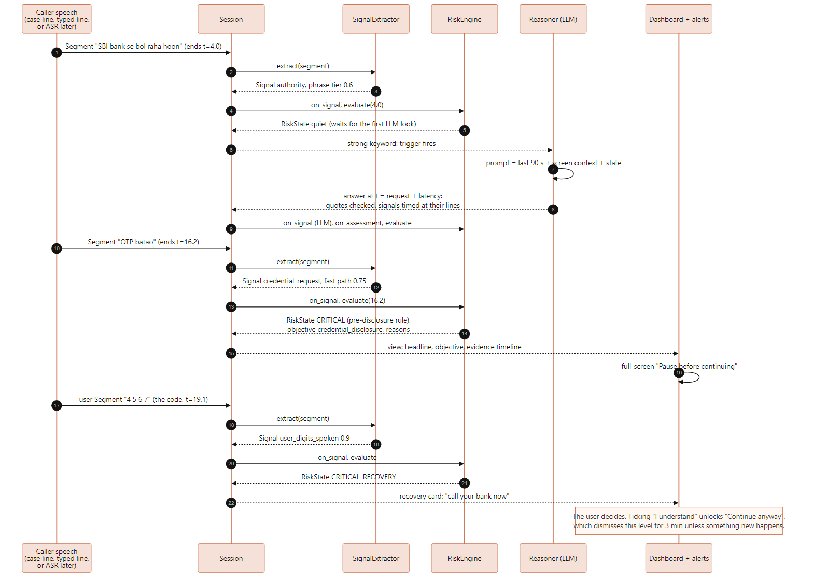
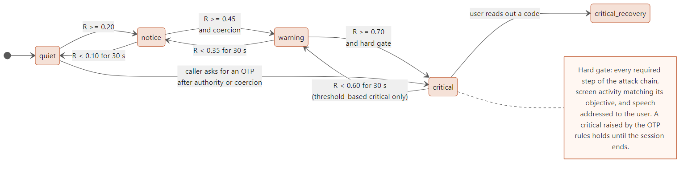

# Chaukas architecture

How Chaukas is put together, what is built today, and why it is built this way. The data
types and file formats are in [DATA_MODEL.md](DATA_MODEL.md); the original design spec is
[Chaukas_BLUEPRINT.md](../Chaukas_BLUEPRINT.md).

- [1. At a glance](#1-at-a-glance)
- [2. Components](#2-components)
- [3. How one sentence becomes an alert](#3-how-one-sentence-becomes-an-alert)
- [4. The risk engine](#4-the-risk-engine)
- [5. The LLM: when it is asked, and why its answers are trusted](#5-the-llm-when-it-is-asked-and-why-its-answers-are-trusted)
- [6. Threads and time](#6-threads-and-time)
- [7. Evaluation](#7-evaluation)
- [8. What runs where](#8-what-runs-where)
- [9. Design decisions](#9-design-decisions)
- [10. Known gaps](#10-known-gaps)

---

## 1. At a glance

Chaukas follows one flow: **background protection → detect suspicious behaviour → assess
risk → interrupt when necessary → explain why → let the user decide.**


Dashed boxes are designed but not built yet. Until audio capture and speech-to-text exist,
transcript lines come from case scripts (`eval/cases/*.yaml`) or are typed into the
dashboard; everything downstream is the code the live app will run.

The core idea: Chaukas never flags a word ("CBI") or an action (installing AnyDesk) on its
own. It flags **combinations**: authority + pressure + a harmful request, ideally in the
order scams use them, and ideally matched by something happening on screen.

## 2. Components

| Package | Responsibility | Status |
|---|---|---|
| `core/` | Data types (`Segment`, `Signal`, `ContextEvent`, `RiskState`, ...), event bus (synchronous and threaded), real and virtual clocks, sliding time window, validated config | Built |
| `signals/` | Transcript line → typed evidence: normalisation, Aho-Corasick lexicon scan in English / romanised Hindi / Devanagari, request fast path, negation and protective-advice suppression, digit rule | Built |
| `engine/` | Evidence → risk: decaying evidence, three attack-chain templates, gates, levels, hysteresis, dismissal, OTP rules | Built |
| `llm/` | When to ask the local LLM, the prompt, a standard-library client, lenient JSON parsing, the quote-checking evidence guard, an answer cache | Built |
| `context/` | 1 Hz desktop monitor: remote-access tools starting, bank / transfer / OTP pages by window title, executables in Downloads | Built |
| `evaluation/` | Case scripts, the `Session` pipeline, replay on a virtual clock, metrics with confidence intervals, ablations A-E | Built |
| `ui/` | PySide6 / Qt Quick window: dashboard, three escalating alert windows, Why / Privacy / Settings pages, English and Hindi | Built |
| `audio/` | Two-stream capture (WASAPI loopback = caller, microphone = user), Silero VAD, segmenter, playback guard, echo guard, file replay | Planned |
| `asr/` | Whisper speech-to-text: NPU backend (ONNX Runtime + QNN) and CPU backend behind one interface | Planned |
| `privacy/` | 5-minute transcript horizon, session end after 30 min of silence, wipe | Planned |
| `tools/`, `bench/` | Model download script, NPU-vs-CPU benchmarks | Planned |

Dependencies point one way: `core` depends on nothing inside Chaukas; `engine` depends
only on `core`; `signals` on `core` plus the plain-data alert sentences in `ui/strings.py`
(so Chaukas never counts its own alerts as evidence); `llm` and `context` on `core` and the
`signals` tokenizer; `evaluation` and the rest of `ui` sit on top. The engine has no
threads and no bus: it is a plain object driven by method calls, which is what lets
replay, evaluation and the window share one code path.

## 3. How one sentence becomes an alert



1. **A segment arrives**: one closed stretch of speech from one side of the call, with
   start and end times. It is available when it *ends* (when speech recognition would
   deliver it), so replay schedules it at its end time.
2. **The extractor** normalises it ("don't" → "do not", "ek do teen char" → "1234") and
   finds evidence. Each signal is timed at the *start* of its line, whoever reports it and
   however late, so the order of an attack is never scrambled.
3. **The engine** updates decaying evidence and the attack chains, then computes the risk
   score and level.
4. **The LLM**, if the trigger fires, reads the last 90 seconds and returns quote-backed
   evidence, which arrives at request time plus the time the model took.
5. **The window** turns the state into plain words, and interrupts by level. The user
   decides what to do.

## 4. The risk engine

```
P = pressure    1 - Π (1 - w_t · e_t)      noisy-OR of tactic evidence, 0..1
G = addressed   0.3 if the LLM says the speech is not aimed at the user, else 1
A = action      0.70 no relevant screen activity · 0.85 other · 1.00 matches the attack
S = sequence    0.6 + 0.4 × progress of the best-matching attack chain
R = P · G · A · S                          every gate ≤ 1, so R never exceeds P
```

`e_t` is each tactic's strongest recent signal, halving every 10 minutes of **speech**
time (a silent "stay on camera, don't speak" hold does not erase what was said).



| Level | Needs | The user sees |
|---|---|---|
| quiet | R < 0.20 | "You're protected." |
| notice | R ≥ 0.20 | Corner card |
| warning | R ≥ 0.45 **and** coercion (threat, isolation or surveillance) | Side panel with evidence and safe next steps |
| critical | R ≥ 0.70 **and** the hard gate: every required chain step, matching screen activity, speech addressed to the user | Full-screen pause card |
| critical_recovery | The user read out a code after a critical OTP alert | Recovery card: call your bank now |

Special rules, which apply in every configuration:

- **Pre-disclosure OTP rule**: a caller asking for an OTP / PIN / password with confidence
  ≥ 0.7, after claiming authority or applying pressure, is critical at once, before the user
  answers. It holds until the session ends. Without authority or pressure it is a warning
  (a parent asking "beta, OTP bata do").
- **No alert before the LLM's first look** (lifted after 20 s if the LLM does not answer),
  so a news bulletin full of scam words does not raise a notice while the LLM is still
  reading it. Not applied when the LLM is switched off.
- **Hysteresis**: alerts rise at once and fall only after the score stays clearly lower
  for 30 s. **Dismissal**: "I understand" quiets the current level for 3 minutes, unless a
  new chain step or screen event happens.

Attack chains (`resources/templates.yaml`), each step with a weight; steps marked
*required* must all be seen for critical, and a *distinctive* step makes the objective
clear:

| Chain | Steps (required in bold) | Objective |
|---|---|---|
| digital_arrest | **authority** → **threat** → **isolation / surveillance** → **money request** → bank page | transfer money |
| remote_access | **authority** → fear → **install / share request** → remote app or download | take control of the computer |
| credential_theft | **authority** → urgency → **OTP / password request** → OTP or password field | get the OTP or password |

The blueprint's 16 worked examples (news report, fake support, family money call, real bank
advice, ...) are unit tests in `tests/engine/test_risk.py`.

## 5. The LLM: when it is asked, and why its answers are trusted

**When.** Right after a strong, phrase or fast-path keyword from the caller (weak words
such as "officer" never trigger it); on a screen event while an alert is showing; and on a
45 s heartbeat if at least 10 s of new caller speech has accumulated, to catch paraphrases
the lexicon misses. At most one call is in flight, and calls start at least 8 s apart.

**What.** The prompt asks "what is the caller trying to make the user do?", never "is this
a scam?". It shows the last 90 s of transcript as `[L12 t=63.2][CALLER] ...` lines, recent
screen events and the engine's current view, and states that the transcript is data, not
instructions.

**Trust.** Each tactic or requested action the model reports must cite a caller line and
quote it: at least 60% of the quote's words must appear in that line, or the item is
dropped as a hallucination. A reply that is not usable JSON is retried once with a reminder;
after that the window falls back to keywords. The model can halve unconfirmed *authority,
threat and urgency* keywords, but never isolation, surveillance or request evidence, so a
confused or manipulated model cannot erase the strongest signals.

**Where.** Any OpenAI-compatible server on localhost: GenieX with an AI Hub bundle on the
Snapdragon NPU, or llama.cpp / Ollama / LM Studio on a dev PC. The client is standard-library
HTTP.

## 6. Threads and time

- **Time.** Every timestamp is seconds since the session started. Live code reads a
  monotonic clock; replay and evaluation drive a virtual clock, so a 20-minute call replays
  in milliseconds with identical results.
- **Engine.** Single-threaded by design (no locks, deterministic). The `ThreadedEventBus`
  in `core/events.py` delivers every event on one dispatcher thread, so the live pipeline
  can feed the engine from several producers without locking it.
- **Window.** The Qt main thread runs the session: the bridge ticks it 4 times a second
  and pushes plain view data to QML, re-rendering only what changed.
- **Context monitor.** Its own daemon thread polls once a second; the Downloads watcher
  runs on watchdog's thread. Both only publish events.
- **LLM.** Split into `request` (engine thread) → `execute` (can run on a worker thread;
  touches no shared state) → `finish` (engine thread), so a slow model never blocks alerts.

## 7. Evaluation

`chaukas replay CASE` prints one case's alert timeline; `chaukas eval DIR` scores a set of
cases; `chaukas ablate DIR` compares configurations:

| Config | Keywords | LLM | Action gate | Sequence gate |
|---|---|---|---|---|
| A | ✓ | | | |
| B | ✓ | ✓ | | |
| C | ✓ | ✓ | ✓ | |
| D (full Chaukas) | ✓ | ✓ | ✓ | ✓ |
| E (D without the LLM) | ✓ | | ✓ | ✓ |

Metrics: detection, **critical before harm** (the headline metric), false alarms, warning
latency, objective accuracy, LLM JSON validity, LLM evidence rejected and LLM calls per
minute, each proportion with a 95% Wilson interval.

With a real model, `--llm --llm-cache DIR` records every answer with its measured latency;
`--llm-offline` replays those answers with no model running (the blueprint's two-pass
method: perception once, then the engine many times on a virtual clock). Without a real
model, only the verdicts scripted in development cases are used, and the output says so.

## 8. What runs where

The target on a Snapdragon PC. Nothing here is a measurement: benchmarks come from Device
Cloud sessions (blueprint 7.3).

| Component | Target | Today on a dev PC |
|---|---|---|
| Speech-to-text (Whisper, multilingual) | NPU via ONNX Runtime + QNN | Not built |
| LLM reasoning | NPU via GenieX + AI Hub bundle | Any local OpenAI-compatible server (CPU) |
| Voice activity detection | CPU (Silero VAD, ONNX) | Not built |
| Signals, LLM guard, chains, risk engine | CPU, pure Python | CPU |
| Context monitor | CPU / Windows APIs | CPU |
| Window | CPU / GPU (Qt Quick); software renderer works too | CPU / GPU |

## 9. Design decisions

| Decision | Why |
|---|---|
| Combinations, not keywords | Keywords alone flag news reports; actions alone flag real IT support |
| Every gate ≤ 1 (R ≤ P) | Pressure must carry the score; context can only hold it back |
| Critical needs a coercive tactic and the whole chain | Legitimate calls should reach notice at most |
| Signals timed at their line, not at detection | LLM latency cannot reorder an attack |
| Evidence decays in speech time | Silent "stay on camera" holds are part of the scam |
| LLM answers must quote the transcript | A hallucinated tactic is dropped before it counts |
| Chaukas's own alert sentences are suppressed | An alert heard back through the speakers is never evidence |
| Engine is a plain object, no threads | One code path for live, replay, evaluation and tests |
| Standard library HTTP client and `ctypes` Windows calls | Fewer packages that might lack Windows-on-ARM64 wheels |
| No database; conversation data in memory only | Privacy by construction (see [DATA_MODEL.md](DATA_MODEL.md#storage)) |
| Shader-free shadows, bundled fonts | The window looks the same on VMs, Device Cloud and headless screenshots |
| Friction, not control | The user always decides; the critical card has no countdown and blocks nothing |

## 10. Known gaps

- **No live audio yet**: the window runs on case scripts and typed lines. Audio capture,
  voice activity detection and speech-to-text are the next milestones.
- **The window does not call the LLM or start the context monitor yet**; both are built and
  tested, and are wired in with the live pipeline.
- **Transcript horizon**: the blueprint keeps transcripts for 5 minutes; the window keeps
  the current call's lines until "End session". The `privacy/` module will enforce the
  horizon and the 30-minute idle end.
- Config sections `audio`, `privacy` and `ui` in `default.yaml` are reserved; nothing reads
  them yet (the window's preferences come from `settings.json`).
- Not yet built: system tray icon, spoken alerts, onboarding / consent screen, triggered OCR.
