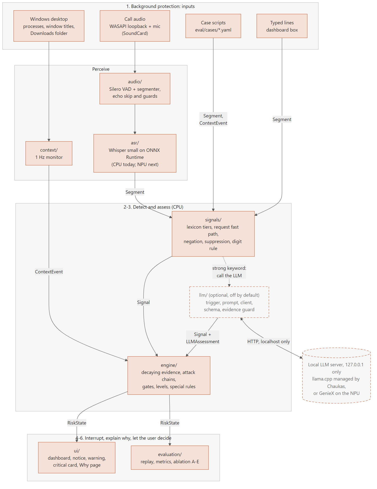
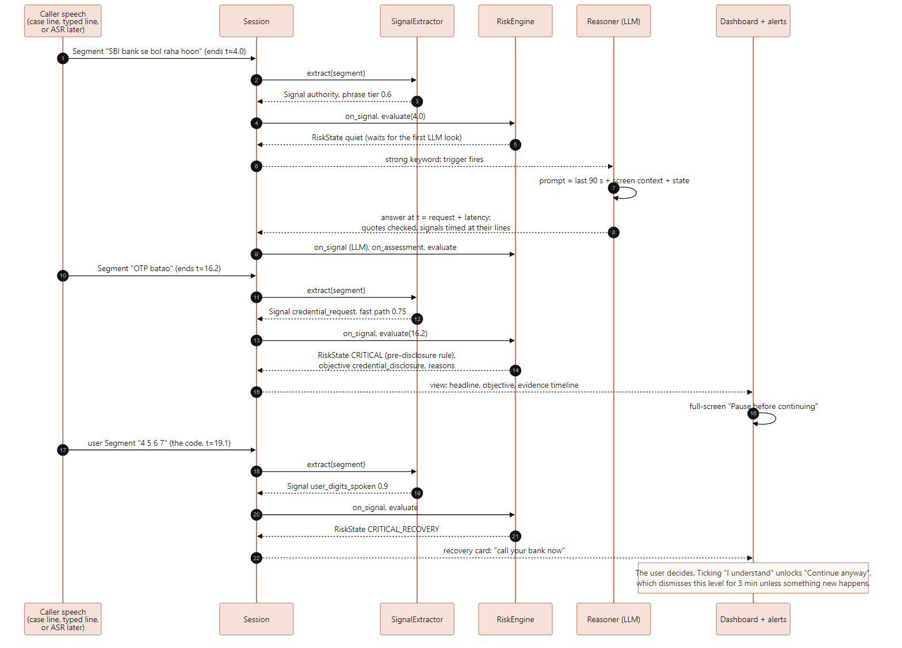
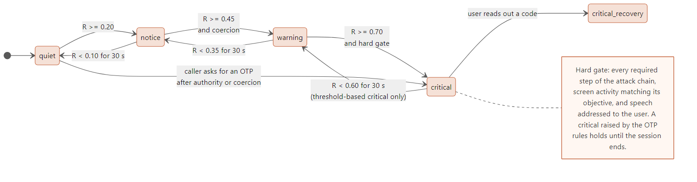

# Chaukas architecture

How Chaukas is put together, what is built today, and why it is built this way. The data
types and file formats are in [DATA_MODEL.md](DATA_MODEL.md); the original design spec is
[Chaukas_BLUEPRINT.md](../Chaukas_BLUEPRINT.md); measurements and decisions over time are
in [WORKLOG.md](WORKLOG.md).

- [1. At a glance](#1-at-a-glance)
- [2. Components](#2-components)
- [3. How one sentence becomes an alert](#3-how-one-sentence-becomes-an-alert)
- [4. Live audio](#4-live-audio)
- [5. The risk engine](#5-the-risk-engine)
- [6. The LLM: optional, and why its answers are trusted](#6-the-llm-optional-and-why-its-answers-are-trusted)
- [7. Threads and time](#7-threads-and-time)
- [8. Evaluation](#8-evaluation)
- [9. What runs where](#9-what-runs-where)
- [10. Models and downloads](#10-models-and-downloads)
- [11. Design decisions](#11-design-decisions)
- [12. Known gaps](#12-known-gaps)

---

## 1. At a glance

Chaukas follows one flow: **background protection → detect suspicious behaviour → assess
risk → interrupt when necessary → explain why → let the user decide.**



In live mode (`chaukas run`), transcript lines come from the call's audio through voice
detection and Whisper; in demo mode they come from case scripts (`eval/cases/*.yaml`) or
are typed into the dashboard. Everything downstream of a transcript line is the same code
in live mode, demos, replay, evaluation and tests.

The core idea: Chaukas never flags a word ("CBI") or an action (installing AnyDesk) on its
own. It flags **combinations**: authority + pressure + a harmful request, ideally in the
order scams use them, and ideally matched by something happening on screen.

## 2. Components

| Package | Responsibility |
|---|---|
| `core/` | Data types (`Segment`, `Signal`, `ContextEvent`, `RiskState`, `HeardLine`, ...), event bus, real and virtual clocks, sliding time window, validated config, the models folder |
| `audio/` | WASAPI capture through SoundCard (loopback = caller, microphone = user), a numpy resampler, Silero VAD, the segmenter, playback and echo guards, the threaded pipeline |
| `asr/` | Whisper speech-to-text behind one interface: ONNX Runtime (default; log-mel features and greedy decoding in-house) or faster-whisper; the backend loader |
| `signals/` | Transcript line → typed evidence: normalisation, Aho-Corasick lexicon scan in English / romanised Hindi / Devanagari, request fast path, negation and protective-advice suppression, digit rule |
| `engine/` | Evidence → risk: decaying evidence, three attack-chain templates, gates, levels, hysteresis, dismissal, OTP rules, the remote-banking rule |
| `llm/` | Optional: when to ask the local LLM, the prompt, a standard-library client, the reply schema (sent as a JSON Schema), the quote-checking evidence guard, an answer cache, the managed llama.cpp server |
| `context/` | 1 Hz desktop monitor: remote-access tools starting, bank / transfer / OTP pages by window title, executables appearing in Downloads |
| `evaluation/` | Case scripts, the `Session` pipeline, replay on a virtual clock, metrics with confidence intervals, ablations A-E |
| `ui/` | PySide6 / Qt Quick window: dashboard, three escalating alert windows, Why / Privacy / Settings pages, English and Hindi; the live session and the services that feed it |

Dependencies point one way: `core` depends on nothing inside Chaukas; `engine` depends
only on `core`; `signals` on `core` plus the plain-data alert sentences in `ui/strings.py`
(so Chaukas never counts its own alerts as evidence); `audio`, `asr`, `llm` and `context`
on `core` (and the `signals` tokenizer); `evaluation` and `ui` sit on top. The engine has
no threads: it is a plain object driven by method calls, which is what lets live mode,
replay, evaluation and the tests share one code path.

## 3. How one sentence becomes an alert



1. **Speech is heard** (live mode): 100 ms audio blocks from each stream go through voice
   detection; a sentence closes after 0.6 s of silence (or is cut at its quietest point
   before 12 s) and is transcribed by Whisper.
2. **A segment arrives**: one closed stretch of speech from one side of the call, with
   start and end times. It is available when it *ends*, so replay schedules it at its end
   time.
3. **The extractor** normalises it ("don't" → "do not", "ek do teen char" → "1234") and
   finds evidence. Each signal is timed at the *start* of its line, whoever reports it and
   however late, so the order of an attack is never scrambled.
4. **The engine** updates decaying evidence and the attack chains, then computes the risk
   score and level.
5. **The window** turns the state into plain words, and interrupts by level. The user
   decides what to do.

## 4. Live audio

- **Two streams.** The caller is a *loopback* recording of the default speakers (where
  WhatsApp, Zoom, Teams and Meet play the other person); the user is the default
  microphone. Windows delivers both as 16 kHz mono; SoundCard (pure Python over WASAPI
  through cffi) runs on x64 and ARM64 alike.
- **Voice detection** (Silero VAD v6, ONNX, 32 ms windows, state carried across chunks)
  and a segmenter close sentences after 0.6 s of silence.
- **Echo.** With laptop speakers the microphone also hears the caller. Microphone speech
  that is 80 % inside the caller's speech is skipped before Whisper; a text check drops
  whatever still repeats the caller's words. A user line waits until every caller sentence
  that began before it ended has been transcribed, so the check never runs on half the
  facts.
- **Transcription.** One worker; each speaker's language is detected once and re-checked
  every 6 lines; a backlog of the same speaker's sentences is merged into one call.
- **Time.** Audio is stamped with the session clock on arrival. Gaps close speech in
  progress; a burst of silence delivered all at once (after sleep) is dropped instead of
  pushing the stream clock ahead.

Measured on an i7-1360P: a scam call's OTP request is on screen as critical about 1 s
after the caller finishes saying it (see the README's Results).

## 5. The risk engine

```
P = pressure    1 - Π (1 - w_t · e_t)      noisy-OR of tactic evidence, 0..1
G = addressed   0.3 if the LLM says the speech is not aimed at the user, else 1
A = action      0.70 no relevant screen activity · 0.85 other · 1.00 matches the attack
S = sequence    0.6 + 0.4 × progress of the best-matching attack chain
R = P · G · A · S                          every gate ≤ 1, so R never exceeds P
```

`e_t` is each tactic's strongest recent signal, halving every 10 minutes of **speech**
time (a silent "stay on camera, don't speak" hold does not erase what was said).



| Level | Needs | The user sees |
|---|---|---|
| quiet | R < 0.20 | "You're protected." |
| notice | R ≥ 0.20 | Corner card |
| warning | R ≥ 0.45 **and** coercion (threat, isolation or surveillance), or a special rule below | Side panel with evidence and safe next steps |
| critical | R ≥ 0.70 **and** the hard gate: every required chain step, matching screen activity, speech addressed to the user | Full-screen pause card |
| critical_recovery | The user read out a code after a critical OTP alert | Recovery card: call your bank now |

Special rules, which apply in every configuration:

- **Pre-disclosure OTP rule**: a caller asking for an OTP / PIN / password / "the code you
  got" with confidence ≥ 0.7, after claiming authority or applying pressure, is critical at
  once, before the user answers. It holds until the session ends. Without authority or
  pressure it is a warning (a parent asking "beta, OTP bata do"). A delivery agent asking
  for the order OTP has neither, and stays at notice.
- **Remote-banking rule**: a remote-control app is running, a bank or transfer page opens
  after it, and the caller claimed to be from an organisation (even a weak "customer
  care"): at least a warning. This catches refund and tech-support scams that use no
  threats; family remote help makes no organisation claim.
- **No alert before the LLM's first look** (only when the LLM is on; lifted after 20 s),
  so a news bulletin full of scam words doesn't raise a notice while the LLM reads it.
- **Hysteresis**: alerts rise at once and fall only after the score stays clearly lower
  for 30 s. **Dismissal**: "I understand" quiets the current level for 3 minutes, unless a
  new chain step or screen event happens.

Attack chains (`resources/templates.yaml`), each step with a weight; steps marked
*required* must all be seen for critical, and a *distinctive* step makes the objective
clear:

| Chain | Steps (required in bold) | Objective |
|---|---|---|
| digital_arrest | **authority** → **threat** → **isolation / surveillance** → **money request** → bank page | transfer money |
| remote_access | **authority** → fear → **install / share request** → remote app or download | take control of the computer |
| credential_theft | **authority** → urgency → **OTP / password request** → OTP or password field | get the OTP or password |

The blueprint's 16 worked examples (news report, fake support, family money call, real bank
advice, ...) are unit tests in `tests/engine/test_risk.py`.

## 6. The LLM: optional, and why its answers are trusted

The LLM is **off by default** (configuration E) and not wired into live mode. With
Qwen2.5-1.5B it made every reply valid JSON but mislabelled innocent calls (2/2 false
alarms on the dev set), so it is used only in evaluation (`--llm`) until a stronger model
is available. Live mode refuses the LLM configurations (B-D) rather than hold alerts back
while waiting for an LLM that is never called.

**When.** Right after a strong, phrase or fast-path keyword from the caller (weak words
such as "officer" never trigger it); on a screen event while an alert is showing; and on a
45 s heartbeat if at least 10 s of new caller speech has accumulated. At most one call is in
flight, and calls start at least 8 s apart.

**What.** The prompt asks "what is the caller trying to make the user do?", never "is this
a scam?". It shows the last 90 s of transcript as `[L12 t=63.2][CALLER] ...` lines, recent
screen events and the engine's current view, and states that the transcript is data, not
instructions. The allowed values are listed in words with one format example; the reply
schema is also sent as a JSON Schema, so a server that supports it (llama.cpp) can only
produce a valid reply.

**Trust.** Each tactic or requested action must quote a caller line in the window: at
least 60 % of the quote's words must appear in that line (a real quote cited under a
neighbouring line number is moved to its true line; user lines never count), or the item
is dropped as a hallucination. An unusable reply is retried once, then the window falls
back to keywords. The model can halve unconfirmed *authority, threat and urgency* keywords,
never isolation, surveillance or request evidence, so a confused or manipulated model
cannot erase the strongest signals.

**Where.** With `llm.server: managed` (default), Chaukas starts llama.cpp's `llama-server`
itself, bound to 127.0.0.1 only, and stops it afterwards; it refuses a non-loopback URL and
refuses to share a port already in use. With `llm.server: external`, any
OpenAI-compatible server (e.g. GenieX on a Snapdragon NPU). The client is standard-library
HTTP.

## 7. Threads and time

- **Time.** Every timestamp is seconds since the session started. Live code reads a
  monotonic clock; replay and evaluation drive a virtual clock, so a 20-minute call replays
  in milliseconds with identical results.
- **Audio.** One capture thread per stream (SoundCard), one processing thread per stream
  (resample, VAD, segmenter) and one transcription thread. Capture callbacks only enqueue;
  a full queue drops audio rather than block capture.
- **Engine.** Single-threaded by design. Audio lines and screen events reach it through
  queued Qt signals on the main thread.
- **Window.** The Qt main thread runs the session: the bridge ticks it 4 times a second
  and pushes plain view data to QML, re-rendering only what changed.
- **Context monitor.** Its own daemon thread polls processes, the foreground window and
  the Downloads folder once a second, and only publishes events.
- **LLM.** Split into `request` (engine thread) → `execute` (can run on a worker thread;
  touches no shared state) → `finish` (engine thread), so a slow model never blocks alerts.

## 8. Evaluation

`chaukas replay CASE` prints one case's alert timeline; `chaukas eval DIR [--split test]`
scores a set of cases; `chaukas ablate DIR` compares configurations:

| Config | Keywords | LLM | Action gate | Sequence gate |
|---|---|---|---|---|
| A | ✓ | | | |
| B | ✓ | ✓ | | |
| C | ✓ | ✓ | ✓ | |
| D (full Chaukas) | ✓ | ✓ | ✓ | ✓ |
| E (D without the LLM; default) | ✓ | | ✓ | ✓ |

Metrics: detection, **critical before harm** (the headline metric), false alarms, warning
latency, objective accuracy, LLM JSON validity, LLM evidence rejected and LLM calls per
minute, each proportion with a 95 % Wilson interval.

Cases (`eval/cases/`): 16 dev cases (4 build-time smoke cases, 12 written to fix failure
modes) and 16 held-out test cases (8 scams, 8 look-alike innocent calls), committed before
their first run. Results and the protocol are in the README and WORKLOG.

With a real model, `--llm --llm-cache DIR` records every answer with its measured latency;
`--llm-offline` replays those answers with no model running (perception once, then the
engine many times on a virtual clock).

## 9. What runs where

| Component | On this dev PC (x64, measured) | On a Snapdragon PC (target, not yet measured) |
|---|---|---|
| Speech-to-text (Whisper small int8) | CPU, ONNX Runtime: about 2 s per sentence | CPU (ARM64 build), then the NPU via ONNX Runtime QNN / AI Hub |
| Voice activity detection | CPU (Silero VAD, ONNX), well under 1 ms per window | CPU |
| Optional LLM (Qwen2.5-1.5B Q4) | CPU, llama.cpp: 7.1 s median per call | CPU (llama.cpp ARM64 build) or NPU via GenieX |
| Signals, guard, chains, risk engine | CPU, pure Python | CPU |
| Context monitor | CPU / Windows APIs (`ctypes`) | CPU |
| Window | CPU / GPU (Qt Quick); software renderer works too | same |

## 10. Models and downloads

Only `chaukas setup` downloads anything. Everything lands in `%LOCALAPPDATA%\Chaukas\models`
(or `CHAUKAS_MODELS`) or the local Hugging Face cache, and is pinned:

| What | Source | Check |
|---|---|---|
| Whisper small, ONNX, int8 (~250 MB) | `onnx-community/whisper-small` | loaded from the local cache only |
| Silero VAD v6 (1.2 MB) | faster-whisper release v1.2.1 | SHA-256 |
| llama.cpp `llama-server` (optional; x64 or ARM64 build) | ggml-org release b11218 | SHA-256 from the release; zip entries cannot escape their folder |
| Qwen2.5-1.5B-Instruct Q4_K_M (optional, 1.1 GB) | `Qwen/Qwen2.5-1.5B-Instruct-GGUF`, pinned revision | SHA-256 |

## 11. Design decisions

| Decision | Why |
|---|---|
| Combinations, not keywords | Keywords alone flag news reports; actions alone flag real IT support |
| Every gate ≤ 1 (R ≤ P) | Pressure must carry the score; context can only hold it back |
| Critical needs a coercive tactic and the whole chain | Legitimate calls should reach notice at most |
| Signals timed at their line, not at detection | Transcription and LLM latency cannot reorder an attack |
| Evidence decays in speech time | Silent "stay on camera" holds are part of the scam |
| LLM answers must quote the transcript; LLM off by default | A hallucinated tactic is dropped; a weak model must not add false alarms |
| Whisper on ONNX Runtime, SoundCard, a numpy resampler, polling | Every live-mode dependency has a Windows ARM64 build (CTranslate2, soxr, PyAudioWPatch and watchdog don't) |
| Models pinned and hash-checked; only `setup` downloads | Reproducible results; no network use during a call |
| Chaukas's own alert sentences are suppressed | An alert heard back through the speakers is never evidence |
| Engine is a plain object, no threads | One code path for live, replay, evaluation and tests |
| Held-out cases committed before their first run | Detection numbers are measured, not fitted |
| No database; conversation data in memory only | Privacy by construction (see [DATA_MODEL.md](DATA_MODEL.md#storage)) |
| Friction, not control | The user always decides; the critical card has no countdown and blocks nothing |

## 12. Known gaps

- Not yet run on a Snapdragon laptop; Whisper is not yet on the NPU.
- The LLM is not wired into live mode (and is off by default; see section 6).
- Speech recognition is measured on synthetic English speech only; real Hinglish is
  unmeasured.
- The loopback hears everything the PC plays, and capture follows the default devices
  chosen at start.
- Not yet built: system tray icon, spoken alerts, onboarding / consent screen, triggered
  OCR, a firewall test proving offline operation.
