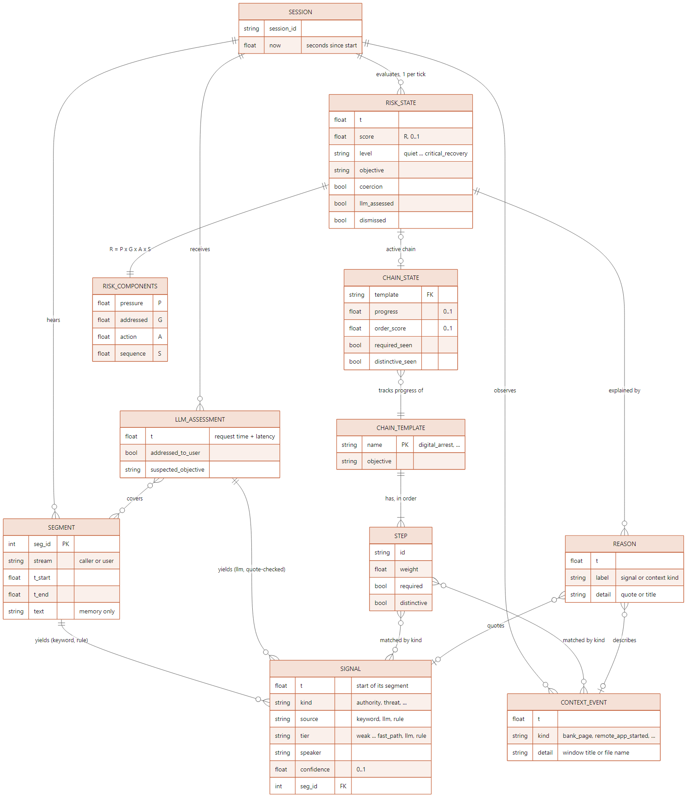
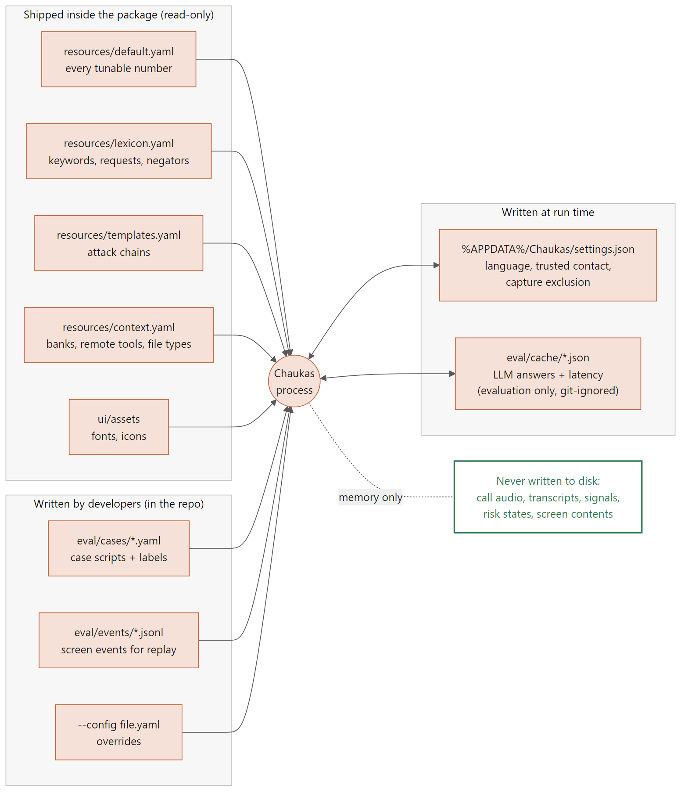

# Chaukas data model and schemas

What Chaukas holds in memory, what it reads and writes on disk, and the exact shape of
every file. The code is the source of truth: types live in `src/chaukas/core/models.py`,
file schemas are validated with pydantic where they are loaded.

- [1. There is no database](#1-there-is-no-database)
- [2. Entity-relationship diagram](#2-entity-relationship-diagram)
- [3. Entities](#3-entities)
- [4. Enumerations](#4-enumerations)
- [5. Storage](#storage)
- [6. File schemas](#6-file-schemas)
- [7. Regenerating the diagrams](#7-regenerating-the-diagrams)

---

## 1. There is no database

On purpose. Chaukas listens to private conversations, so the conversation itself (audio,
transcript, evidence, risk states) exists **only in memory** for the current session and is
discarded when the session ends. The only files written at run time are the user's own
preferences and, during evaluation on synthetic data only, cached LLM answers.

Python cannot guarantee memory is overwritten and Windows can page memory to disk, so the
honest wording is "discarded, never saved", not "securely erased".

## 2. Entity-relationship diagram

The in-memory model. Every record is an immutable, slotted dataclass, so it can cross
threads without locks.



## 3. Entities

Times are always **seconds since the session started**.

### Segment: one closed stretch of speech from one side of the call

| Field | Type | Meaning |
|---|---|---|
| `session_id` | str | The session it belongs to |
| `seg_id` | int ≥ 0 | Line number, shown to the LLM as `[L12]` and cited back by it |
| `stream` | `Stream` | `caller` (system audio) or `user` (microphone) |
| `t_start`, `t_end` | float ≥ 0 | When the speech started and ended (`t_end ≥ t_start`) |
| `text` | str | What was said. **Memory only** |
| `lang` | str or null | Language reported by speech-to-text |
| `asr_ms` | float ≥ 0 | Speech-to-text time for this segment |

### Signal: one piece of evidence

| Field | Type | Meaning |
|---|---|---|
| `t` | float | Start of the segment it came from, **never** the time a detector reported it |
| `kind` | `SignalKind` | What it is evidence of |
| `source` | `SignalSource` | `keyword`, `llm` or `rule` |
| `tier` | `Tier` | How strongly the detector vouches for it |
| `speaker` | `Stream` | Who said it. Only the caller's words are evidence, except `user_digits_spoken` |
| `confidence` | float 0..1 | Weak 0.3, strong 0.5, phrase 0.6, fast path 0.75, LLM as reported, rule 0.9 |
| `evidence` | str | Snippet for the Why panel: the matched words, or the LLM's quote trimmed to 80 characters. **Memory only** |
| `seg_id` | int or null | The segment it came from |

### ContextEvent: something seen on the desktop

| Field | Type | Meaning |
|---|---|---|
| `t` | float | When it was seen |
| `kind` | `ContextKind` | e.g. `transfer_page`, `remote_app_started` |
| `detail` | str | Window title or file name, e.g. `DemoBank (MOCK) - Transfer Funds` |

### LLMAssessment: the parts of an LLM answer that are not signals

| Field | Type | Meaning |
|---|---|---|
| `t` | float | When the answer became available (request time + measured latency) |
| `addressed_to_user` | bool | False for news, films, stories about other people |
| `suspected_objective` | `Objective` | The model's view of what the caller wants |
| `covered_seg_ids` | set of int | Caller lines the model saw |
| `listed_kinds` | set of `SignalKind` | Tactics it confirmed (unconfirmed authority / threat / urgency keywords in covered lines are halved once) |

### ChainTemplate and Step: an attack pattern (loaded from `templates.yaml`)

| Field | Type | Meaning |
|---|---|---|
| `name` | str | `digital_arrest`, `remote_access`, `credential_theft` |
| `objective` | `Objective` | What this attack is after |
| `steps[].id` | str | e.g. `authority`, `install_req` |
| `steps[].signals`, `steps[].events` | sets | Signal kinds and context kinds that count as this step |
| `steps[].weight` | float > 0 | Share of the chain's progress |
| `steps[].required` | bool | Must be seen for critical; progress is capped at 0.75 until then |
| `steps[].distinctive` | bool | Seeing it makes the objective clear |

### ChainState: one template's progress in this session

| Field | Type | Meaning |
|---|---|---|
| `template`, `objective` | | Which template |
| `progress` | float 0..1 | Weight of seen steps / total weight, penalised if out of order |
| `order_score` | float 0..1 | Share of seen step pairs in template order |
| `steps_seen` | list of (step id, first time seen) | The Why panel's timeline |
| `required_seen`, `distinctive_seen` | bool | See Step |

### RiskState: the engine's verdict after each evaluation

| Field | Type | Meaning |
|---|---|---|
| `t` | float | Evaluation time |
| `score` | float 0..1 | R = P · G · A · S |
| `level` | `Level` | What is shown |
| `objective` | `Objective` | What the caller seems to want, or `unclear` / `none` |
| `components` | RiskComponents | `pressure` (P), `addressed` (G), `action` (A), `sequence` (S), each 0..1 |
| `chain` | ChainState or null | The best-matching attack chain |
| `coercion` | bool | Threat, isolation or surveillance evidence ≥ 0.5 |
| `llm_assessed` | bool | The session's first LLM answer has arrived |
| `dismissed` | bool | The user acknowledged this level |
| `reasons` | list of Reason | `(t, label, detail)`: the evidence timeline, oldest first |
| `evidence` | list of (kind, strength) | Each tactic's current decayed strength (the dashboard's rings) |

## 4. Enumerations

| Enum | Values |
|---|---|
| `Stream` | `caller`, `user` |
| `SignalKind` | `authority`, `threat`, `urgency`, `isolation`, `surveillance`, `money_request`, `remote_access_request`, `credential_request`, `user_digits_spoken` |
| `SignalSource` | `keyword`, `llm`, `rule` |
| `Tier` | `weak`, `strong`, `phrase`, `fast_path`, `llm`, `rule` |
| `ContextKind` | `remote_app_started`, `bank_page`, `transfer_page`, `download_executable`, `otp_field_visible`, `password_field_visible`, `window_changed` |
| `Objective` | `money_transfer`, `remote_control`, `credential_disclosure`, `none`, `unclear` |
| `Level` (ordered) | `quiet` < `notice` < `warning` < `critical` < `critical_recovery` |

Coercive kinds: `threat`, `isolation`, `surveillance` (urgency alone is not coercion).
Request kinds: `money_request`, `remote_access_request`, `credential_request`.
Context kinds map to objectives: bank / transfer page → money; remote app / executable →
remote control; OTP / password field → credentials; `window_changed` → none.

<a id="storage"></a>

## 5. Storage



| File | Written by | Contains | Notes |
|---|---|---|---|
| `src/chaukas/resources/default.yaml` | Developers | Every tunable number | Shipped read-only |
| `src/chaukas/resources/lexicon.yaml` | Developers | Keywords, request vocabulary, negators, suppressions | Shipped read-only |
| `src/chaukas/resources/templates.yaml` | Developers | Attack-chain templates | Shipped read-only |
| `src/chaukas/resources/context.yaml` | Developers | Banks, transfer / OTP words, remote tools, executable types | Shipped read-only |
| `eval/cases/*.yaml` | Developers | Case scripts and their hand-written labels | In the repo |
| `eval/events/*.jsonl` | Developers | Screen events for replay | Format defined; no files yet |
| `--config FILE.yaml` | Developers | Overrides, deep-merged over the defaults in order | Optional |
| `%APPDATA%\Chaukas\settings.json` | The window | Language, trusted contact, capture exclusion | The only file a normal user's session writes |
| `eval/cache/**/*.json` | `eval --llm --llm-cache` | LLM answers with measured latency | Contains transcript-derived text: synthetic evaluation data only; git-ignored |
| `models/` | Model download | Model files | Git-ignored; never committed |

## 6. File schemas

Every file is validated when loaded; a missing key, an unknown key or an out-of-range value
is an error that names the file (except `settings.json`, which falls back to defaults so the
app always starts).

### 6.1 `default.yaml` (configuration)

Overrides are passed with `--config FILE.yaml` (repeatable) and deep-merged in order. There
are no defaults in code: a key missing from the merged result is an error.

| Section | Key | Default | Meaning |
|---|---|---|---|
| `signals` | `weak`, `strong`, `phrase`, `fast_path` | 0.3, 0.5, 0.6, 0.75 | Keyword tier confidences (must increase) |
| | `fast_path_window_tokens` | 6 | Request verb and object must be this close |
| | `digit_min`, `digit_max` | 4, 8 | Length of a spoken code |
| | `digit_lookback_s` | 90 | Digits count only this soon after a credential request |
| | `digit_request_min_confidence` | 0.6 | ...and only if that request was this confident |
| | `digit_confidence` | 0.9 | Confidence of `user_digits_spoken` |
| `llm` | `base_url`, `model` | `http://127.0.0.1:8080/v1`, `""` | OpenAI-compatible endpoint and model name |
| | `window_s`, `context_lookback_s` | 90, 300 | Transcript and screen history in the prompt |
| | `heartbeat_s`, `heartbeat_min_speech_s` | 45, 10 | Heartbeat call, if enough new caller speech |
| | `debounce_s` | 8 | Minimum gap between calls |
| | `timeout_s` | 10 | Per request |
| | `failure_grace_s` | 20 | Lift the "wait for the LLM" cap after this long |
| | `max_tokens`, `temperature` | 300, 0.0 | Generation settings |
| | `can_discount` | true | Allow halving unconfirmed authority / threat / urgency keywords |
| | `evidence_min_overlap` | 0.6 | Share of a quote's words that must be in the cited line |
| `engine` | `weights.<kind>` | authority 0.5, threat 0.7, urgency 0.4, isolation 0.9, surveillance 0.9, money 0.8, remote access 0.6, credential 0.9 | Weight of each tactic in P (exactly these eight kinds) |
| | `evidence_half_life_s` | 600 | Half-life in speech time |
| | `thresholds.notice / warning / critical` | 0.20 / 0.45 / 0.70 | Level thresholds on R (must increase) |
| | `gates.addressed_false` | 0.3 | G when speech is not addressed to the user |
| | `gates.addressed_true_memory_s` | 90 | A recent "addressed" answer overrides a later "not" |
| | `gates.action_none / action_other / action_match` | 0.70 / 0.85 / 1.00 | A (must not decrease) |
| | `gates.context_lookback_s` | 300 | Screen events older than this no longer count |
| | `gates.sequence_floor` | 0.6 | S at zero chain progress |
| | `chain.step_min_confidence` | 0.5 | Weakest signal that counts as a chain step |
| | `chain.required_step_cap` | 0.75 | Progress cap while a required step is missing |
| | `chain.order_penalty_threshold`, `chain.order_penalty` | 0.7, 0.85 | Out-of-order steps multiply progress by 0.85 |
| | `chain.tie_margin` | 0.05 | Chains this close compete on distinctive steps |
| | `rules.min_evidence` | 0.5 | Decayed evidence that counts as present |
| | `rules.pre_disclosure_min_confidence` | 0.7 | OTP request strength for the pre-disclosure rule |
| | `rules.hysteresis_margin`, `rules.hysteresis_hold_s` | 0.10, 30 | De-escalate after R < threshold − margin for this long |
| | `rules.dismissal_s` | 180 | How long "I understand" quiets a level |
| `ablation` | `use_llm`, `use_action_gate`, `use_sequence` | all true | Switch layers off for configurations A-E |
| `audio` | `sample_rate`, `vad_silence_ms`, `max_segment_s`, `playback_guard_tail_ms`, `echo_similarity` | 16000, 600, 12, 300, 0.6 | **Reserved**: audio capture is not built |
| `ui` | `capture_exclusion`, `language` | false, en | **Reserved**: the window reads `settings.json` |
| `privacy` | `transcript_horizon_s`, `session_idle_end_s`, `debug_text_logs` | 300, 1800, false | **Reserved**: the privacy module is not built |

### 6.2 `lexicon.yaml`

```yaml
version: 1
tactics:                     # one entry per SignalKind except user_digits_spoken
  authority:
    terms: [cbi, police, cyber cell, पुलिस, bank se bol raha]   # 1 word = strong, 2+ = phrase
    weak: [officer, customer care]                          # weak: never a chain step
requests:                    # request kinds only
  credential_request:
    verbs: [tell, batao, बताओ]
    objects: [otp, password, ओटीपी]
negation:
  gap: 1                     # words allowed between a negator and its verb
  before: [not, never, mat, nahi, मत]
  after: [nahi, नहीं]
suppress: [pin code, पिन कोड]   # keyword hits inside these count for nothing
```

Every entry passes through the transcript's own normaliser, so case, apostrophes and
Devanagari digits don't matter. English entries also match `-s/-es/-ed/-ing` forms. Every
sentence of Chaukas's alert text (`ui/strings.py`) is added to `suppress` automatically.

### 6.3 `templates.yaml`

```yaml
digital_arrest:
  objective: money_transfer          # not none / unclear
  steps:                             # in the order attackers usually use them
    - {id: authority, signals: [authority], weight: 1.0, required: true, distinctive: false}
    - {id: bank_ctx, events: [bank_page, transfer_page], weight: 1.0, required: false, distinctive: true}
```

Rules: each step lists signals and/or events; ids are unique within a template; at least
one step is required.

### 6.4 `context.yaml`

```yaml
version: 1
banks: [demobank, sbi, hdfc, netbanking]      # a title must name a bank first
transfer_words: [transfer, beneficiary, neft, imps]
otp_words: [otp, one time password, ओटीपी]
remote_tools:
  process_names: [anydesk.exe, quickassist.exe]
  product_keywords: [anydesk, teamviewer]     # matched against CompanyName / ProductName
executable_extensions: [.exe, .msi, .apk]
screen: {otp: [...], password: [...], transfer: [...], transfer_min_hits: 2}
```

### 6.5 Case script (`eval/cases/*.yaml`)

```yaml
case_id: DA01
category: attack                   # attack | benign
scenario: digital_arrest
split: dev                         # dev | test; blind scripts go to test
author: me
language: hinglish                 # optional, default en
notes: >                           # optional
  Free text.
expected:
  max_level: critical
  acceptable_levels: [critical]    # must include max_level
  objective: money_transfer
timeline:                          # each entry: exactly one of caller / user / event / mark / llm
  - {at: 0.0, caller: "Namaste, main CBI se bol raha hoon."}
  - {at: 1.0, mark: first_tactic}  # first_tactic | expected_warning | harm (attacks need harm)
  - {after: 1.5, user: "Kya?", duration: 1.2}      # 'after' = gap after the previous entry
  - {at: 15.0, llm: {addressed_to_user: true, objective: money_transfer}}   # dev cases only
  - {at: 29.0, event: bank_page, detail: "DemoBank (MOCK) - Login"}
  - {at: 42.0, mark: harm}
```

Speech without `duration` is estimated at 2.5 words per second. `harm` is when the harm
happens (transfer submitted, access granted, code spoken), not when a page appears.

### 6.6 Screen events for replay (`eval/events/*.jsonl`)

One JSON object per line, in any order (read back sorted by time):

```json
{"t": 52.0, "kind": "bank_page", "detail": "DemoBank (MOCK) - Login"}
```

### 6.7 LLM reply

What the model must return. Parsing finds the object inside chatter or code fences,
accepts `"0.7"` and `"true"`, and drops invalid items one by one.

```json
{
  "addressed_to_user": true,
  "claimed_identity": "cbi",
  "tactics": [{"name": "threat", "line": 12, "evidence": "arrest warrant hai", "confidence": 0.8}],
  "requested_actions": [{"action": "money_transfer", "line": 14, "evidence": "amount transfer karo", "confidence": 0.9}],
  "user_compliance": "unclear",
  "suspected_objective": "money_transfer",
  "benign_explanation": ""
}
```

| Field | Required | Values |
|---|---|---|
| `addressed_to_user` | yes | bool |
| `suspected_objective` | yes | `money_transfer`, `remote_control`, `credential_disclosure`, `none`, `unclear` |
| `claimed_identity` | no | `police`, `cbi`, `ed`, `trai`, `rbi`, `bank`, `customs`, `courier`, `tech_support`, `telecom`, `government`, `family`, `none`, `other` (unknown → `other`) |
| `tactics[].name` | | `authority`, `threat`, `urgency`, `isolation`, `surveillance` |
| `requested_actions[].action` | | `money_transfer`, `install_remote_app`, `share_screen`, `download_file`, `disclose_otp`, `disclose_password`, `open_bank_site` (the last counts at half confidence) |
| `user_compliance` | no | `complied`, `resisting`, `unclear` (`complied` after a credential request counts as disclosure) |
| `benign_explanation` | no | Logged for evaluation; never shown to the user |

### 6.8 LLM cache entry (`eval/cache/**/<key>.json`)

```json
{"model": "qwen2.5-1.5b", "content": "{...raw answer...}", "latency_s": 3.2}
```

The file name is the first 32 hex digits of SHA-256 over the model name and the full message
list, so any change to the prompt is a new entry. Failures are not cached.

### 6.9 `settings.json`

```json
{"language": "en", "contact_name": "Maa", "contact_number": "+91 98765 43210", "capture_exclusion": false}
```

`language` is `en` or `hi`; the name is trimmed to 40 characters; the number keeps only
digits, spaces, `+` and `-`. Unknown or invalid fields are ignored, and a missing or damaged
file gives defaults.

## 7. Regenerating the diagrams

Sources are in [`docs/diagrams/`](diagrams/) (Mermaid); the PNGs in `docs/images/` are
rendered from them:

```powershell
npx -y @mermaid-js/mermaid-cli@11 -i docs/diagrams/data-model.mmd -o docs/images/data-model.png `
    -s 2 -b white -c docs/diagrams/mermaid-config.json
```
